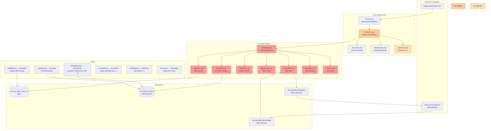
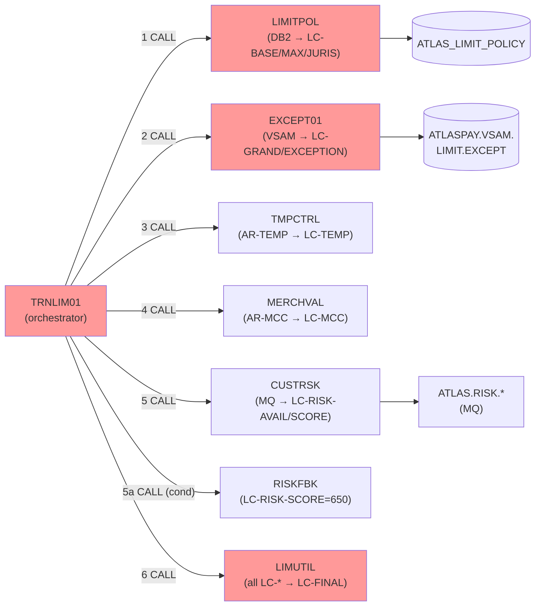
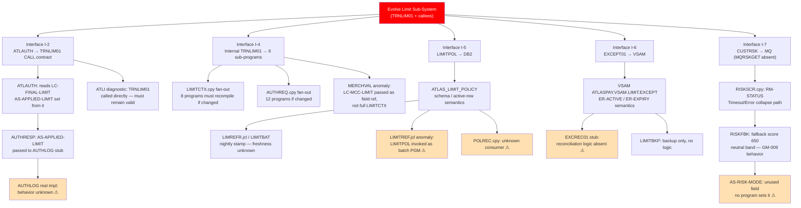

# Raw Bob Output — Native Impact Analysis

Run: atlaspay-understand-001
Stage: UNDERSTAND
Capability: IBM Bob PP4Z Impact Analysis
Execution mode: PP4Z workspace
Z Understand: Not configured
Manual corrections: None
Human clarification during run: Yes

Clarification supplied:
- No target modernization boundary was assumed.
- Existing interfaces were to be identified as evidence, not selected as architecture.
- Stubbed/absent implementations remained in impact scope as unresolved dependencies.

---

# Impact Analysis Report: Dynamic Transaction Limit — Capability Evolution

**Created**: 2026-09-16T00:00:00Z  
**Author**: IBM Bob Premium Package for Z AI Assistant  
**Analysis Method**: Local Workspace (source-file direct analysis; no local DB; Z Understand not configured)  
**Workspace Alignment**: Not Applicable (no Z Understand project)  
**Confidence Level**: Medium  
**Stage**: UNDERSTAND — no modernization solution, target architecture, or implementation approach is recommended

---

## 1. Change Summary

### Change Specification

**Title**: Dynamic Transaction Limit — Capability Evolution Behind a Stable Boundary

**Type**: Evolution (UNDERSTAND-stage characterization; change type TBD)

**Description**: Evolve the AtlasPay Dynamic Transaction Limit capability while preserving all existing observable behaviors. The change must not break the behavioral assertions documented in the golden-master test suite (`tests/golden-master/cases.yaml`, GM-001–GM-012). This analysis identifies all artifacts, interfaces, and couplings that a future change would need to account for — without prescribing any target architecture.

**Business Objective**: As stated in `docs/business-context.md` (lines 5–6): *"make transaction limits more dynamic by incorporating product configuration, transaction context, jurisdiction, temporary customer controls, and current risk indicators."* All of these inputs are already implemented; the objective is about making the capability evolvable, not adding new inputs at this stage.

**Constraint**: UNDERSTAND stage only. Do not recommend a modernization solution or target architecture.

### System Context

**Key Technologies**: COBOL, CICS (transaction dispatch), DB2 (embedded SQL), VSAM KSDS, IBM MQ (request-reply via wrapper), JCL (batch), copybooks

**Entry Points**: CICS transaction `ATLA` → `ATLAUTH` (online); CICS transaction `ATLI` → `TRNLIM01` (diagnostic); JCL `LIMREFR` → `LIMITBAT` (batch nightly)

**Behavioral Contract**: 12 golden-master cases in `tests/golden-master/cases.yaml` define the authoritative expected outputs. These cases cover: baseline policy lookup, grandfathered exception override, jurisdiction cap, temporary control, MCC cap (gambling/quasi-cash), risk adjustment (elevated/low/neutral/fallback), product-max ceiling, approve/decline decision boundary.

---

## 2. Scope Definition

### In Scope (directly implicated by any evolution of this capability)

| Component | Role | Source |
|---|---|---|
| `ATLAUTH.cbl` | Online orchestrator; external-facing entry point for CICS `ATLA` | `src/cobol/ATLAUTH.cbl` |
| `TRNLIM01.cbl` | Limit sub-system orchestrator; also CICS `ATLI` diagnostic entry | `src/cobol/TRNLIM01.cbl` |
| `LIMITPOL.cbl` | DB2 policy reader | `src/cobol/LIMITPOL.cbl` |
| `EXCEPT01.cbl` | VSAM grandfathered exception reader | `src/cobol/EXCEPT01.cbl` |
| `TMPCTRL.cbl` | Temp-control pass-through | `src/cobol/TMPCTRL.cbl` |
| `MERCHVAL.cbl` | Hardcoded MCC cap logic | `src/cobol/MERCHVAL.cbl` |
| `CUSTRSK.cbl` | MQ risk-score requestor | `src/cobol/CUSTRSK.cbl` |
| `RISKFBK.cbl` | Deterministic MQ-unavailable fallback | `src/cobol/RISKFBK.cbl` |
| `LIMUTIL.cbl` | Final limit calculation engine | `src/cobol/LIMUTIL.cbl` |
| `AUTHREQ.cpy` | Shared request structure (8 fields) | `src/copybooks/AUTHREQ.cpy` |
| `LIMITCTX.cpy` | Shared limit-context structure (10 fields) | `src/copybooks/LIMITCTX.cpy` |
| `RISKSCR.cpy` | MQ message layout for risk request/response | `src/copybooks/RISKSCR.cpy` |
| `EXCEPTREC.cpy` | VSAM exception record layout | `src/copybooks/EXCEPTREC.cpy` |
| `ATLAS_LIMIT_POLICY` (DB2) | Policy reference data (base/max/juris limits) | `db2/schema.sql` |
| `ATLASPAY.VSAM.LIMIT.EXCEPT` | Grandfathered exception KSDS | `vsam/DEFINE.jcl` |
| `ATLAS.RISK.REQUEST` / `ATLAS.RISK.RESPONSE` | MQ queues for risk scoring | `mq/queues.yaml` |
| CICS transaction `ATLA` | Online dispatch binding | `cics/transactions.yaml` |
| CICS transaction `ATLI` | Diagnostic dispatch binding | `cics/transactions.yaml` |

### Out of Scope (not part of the limit capability; stable guards)

| Component | Role | Rationale |
|---|---|---|
| `ACCTVAL.cbl` | Account blank-check guard | Fires before limit logic; behavior is independent |
| `MERCHCHK.cbl` | MCC blank-check guard | Fires before limit logic; behavior is independent |
| `ATLAS_ACCOUNT_PRODUCT` (DB2) | Account→product mapping | Not queried by any in-scope program |

### Unresolved External Dependencies (in scope for tracking; behavior unverifiable)

| Component | Nature | Evidence of Interface |
|---|---|---|
| `MQRSKGET` | MQ request-reply wrapper; source absent | `CALL 'MQRSKGET' USING RISK-MESSAGE` at `CUSTRSK.cbl:16` |
| `AUTHLOG.cbl` | Audit sink; stub with no I/O | `ATLAUTH.cbl:47`; `AUTHLOG.cbl:10` comment confirms stub |
| `EXCREC01.cbl` | Monthly VSAM reconciliation; stub | `EXCREC01.cbl:6` comment |
| `AUTHRPT.cbl` | Daily reporting; stub | `AUTHRPT.cbl:6` comment |

### Functional Area

**Primary Functional Area**: Online Card Authorization — Transaction Limit Determination

**Business Function Summary**: Given an authorization request (account, product, jurisdiction, MCC, amount, temp-control), determine the maximum permissible transaction amount and return an approve/decline decision.

---

## 3. System Overview

### System Context Diagram

**Legend**: 🔴 Red = core limit sub-system (primary evolution scope) · 🟠 Orange = orchestrator/interface layer · ⚠ = stub or absent implementation

---

## 4. Observable Interfaces and Coupling Points

This section is the central finding for an UNDERSTAND-stage evolution analysis. It maps every observable interface and coupling — without prescribing which should become a formal boundary.

### 4.1 Interface I-1: Digital Authorization API → CICS ATLA → ATLAUTH

**Type**: CICS transaction dispatch  
**Evidence**: `cics/transactions.yaml:2-4` — `ATLA` → `ATLAUTH`

**Input population mechanism**: `ATLAUTH` COPYs `AUTHREQ` into its **WORKING-STORAGE** (not LINKAGE). Source: `ATLAUTH.cbl:6`. How `AUTH-REQUEST` is populated before `ATLAUTH` begins executing is **not visible** in any workspace artifact. The `ATLAS_ACCOUNT_PRODUCT` table (`db2/schema.sql:15`) exists and holds account→product/jurisdiction mappings, but no program in scope queries it. This is a **known unknown** — the upstream population of `AR-PRODUCT-CODE`, `AR-JURISDICTION`, `AR-TEMP-CONTROL-AMT`, and `AR-TRANSACTION-TYPE` cannot be verified from the workspace.

**Coupling**: `AUTH-REQUEST` structure (`AUTHREQ.cpy`) is the de-facto contract between the Digital Authorization API and all downstream programs. All 8 fields of `AUTH-REQUEST` are used by at least one in-scope program. Any change to `AUTHREQ.cpy` layout affects every program that COPYs it (all 12 online programs).

---

### 4.2 Interface I-2: ATLAUTH → TRNLIM01 (CALL contract)

**Type**: COBOL static CALL  
**Evidence**: `ATLAUTH.cbl:32` — `CALL 'TRNLIM01' USING AUTH-REQUEST LIMIT-CONTEXT`

**Inputs passed**: `AUTH-REQUEST` (`AUTHREQ.cpy`) + `LIMIT-CONTEXT` (`LIMITCTX.cpy`)  
**Output consumed**: `LC-FINAL-LIMIT` from `LIMIT-CONTEXT` at `ATLAUTH.cbl:33`  
**Decision logic in ATLAUTH**: `AR-AMOUNT <= LC-FINAL-LIMIT` → approve/decline (`ATLAUTH.cbl:35-41`)

**Observed characteristics making this a candidate stable boundary**:
- `ATLAUTH` reinitializes `LIMIT-CONTEXT` before calling `TRNLIM01` (`ATLAUTH.cbl:15`), so `TRNLIM01` receives a clean context on every invocation.
- `TRNLIM01` also reinitializes `LIMIT-CONTEXT` at its own entry (`TRNLIM01.cbl:10`) — double initialization. This is a coupling observation: both programs assume ownership of initialization. If `TRNLIM01` is replaced or wrapped, this duplicate initialization must be preserved or explicitly resolved.
- The only value consumed by `ATLAUTH` after the call is `LC-FINAL-LIMIT`. All intermediate limit fields (`LC-BASE-LIMIT`, `LC-JURIS-LIMIT`, etc.) are internal to the sub-system from `ATLAUTH`'s perspective.
- `ATLAUTH` copies `LC-FINAL-LIMIT` to `AS-APPLIED-LIMIT` (`ATLAUTH.cbl:33`) and writes it to `AUTH-RESPONSE`. This means `LC-FINAL-LIMIT` flows through to the audit record.

**What remains a future decision**: Whether this CALL interface becomes the formal capability boundary, or whether the boundary is drawn at CICS `ATLA`, or at a new API wrapper, is an architectural decision not supported by the current evidence alone.

---

### 4.3 Interface I-3: ATLAUTH → AUTHLOG (audit)

**Type**: COBOL static CALL (stub)  
**Evidence**: `ATLAUTH.cbl:47` — `CALL 'AUTHLOG' USING AUTH-REQUEST AUTH-RESPONSE`  
**Stub status**: `AUTHLOG.cbl:10` — "Synthetic audit sink. Real I/O intentionally omitted."

**Impact**: `AUTH-RESPONSE` (copybook `AUTHRESP.cpy`) is passed to `AUTHLOG`. This structure includes `AS-APPLIED-LIMIT`, `AS-DECISION`, `AS-REASON-CODE`, and `AS-RISK-MODE`. Any evolution that changes the semantics of these fields, or alters when/whether `WRITE-AUDIT` is called, has impact on the real `AUTHLOG` implementation that is absent from this workspace. **Internal behavior of the real audit sink cannot be verified.**

---

### 4.4 Interface I-4: TRNLIM01 → Six Sub-Programs (internal sub-system CALLs)

**Type**: Six sequential COBOL static CALLs  
**Evidence**: `TRNLIM01.cbl:12-22`

| Call | Signature | Fields Read | Fields Written |
|---|---|---|---|
| `LIMITPOL` | AUTH-REQUEST, LIMIT-CONTEXT | AR-PRODUCT-CODE, AR-JURISDICTION | LC-BASE-LIMIT, LC-PRODUCT-MAX, LC-JURIS-LIMIT |
| `EXCEPT01` | AUTH-REQUEST, LIMIT-CONTEXT | AR-ACCOUNT-ID | LC-GRANDFATHERED, LC-EXCEPTION-LIMIT |
| `TMPCTRL` | AUTH-REQUEST, LIMIT-CONTEXT | AR-TEMP-CONTROL-AMT | LC-TEMP-LIMIT |
| `MERCHVAL` | AUTH-REQUEST, LC-MCC-LIMIT (field ref) | AR-MERCHANT-CATEGORY | LC-MCC-LIMIT |
| `CUSTRSK` | AUTH-REQUEST, LIMIT-CONTEXT | AR-ACCOUNT-ID | LC-RISK-AVAILABLE, LC-RISK-SCORE |
| `RISKFBK` (conditional) | AUTH-REQUEST, LIMIT-CONTEXT | (nothing from request) | LC-RISK-SCORE (sets 650), LC-RISK-AVAILABLE (stays 'N') |
| `LIMUTIL` | AUTH-REQUEST, LIMIT-CONTEXT | All LC-* fields | LC-FINAL-LIMIT |

**Coupling observation — `MERCHVAL` anomaly**: `TRNLIM01` passes `LC-MCC-LIMIT` as a bare field reference (not the full `LIMIT-CONTEXT`): `CALL 'MERCHVAL' USING AUTH-REQUEST LC-MCC-LIMIT` (`TRNLIM01.cbl:15`). `MERCHVAL` receives it as `LK-MCC-LIMIT PIC 9(7)V99` (`MERCHVAL.cbl:7`). This direct field reference bypasses the `LIMIT-CONTEXT` structure. If `LIMITCTX.cpy` is reorganized or if `LC-MCC-LIMIT`'s offset changes, this reference is at risk of silent misalignment.

**Coupling observation — shared mutable LIMIT-CONTEXT**: All six sub-programs share a single `LIMIT-CONTEXT` instance passed by reference. Writes by earlier programs (e.g., `LIMITPOL` writing `LC-BASE-LIMIT`) are visible to later programs (`LIMUTIL` reading `LC-BASE-LIMIT`). The ordering of calls in `TRNLIM01` is semantically load-bearing — changing the call sequence would change results.

---

### 4.5 Interface I-5: LIMITPOL → DB2 ATLAS_LIMIT_POLICY

**Type**: Embedded SQL `SELECT INTO`  
**Evidence**: `LIMITPOL.cbl:16-23`

**Query**: `SELECT BASE_LIMIT, PRODUCT_MAX, JURIS_LIMIT … WHERE PRODUCT_CODE = :AR-PRODUCT-CODE AND JURISDICTION = :AR-JURISDICTION AND ACTIVE_FLAG = 'Y'`

**Coupling observations**:
1. No `EFFECTIVE_DATE` filter despite `EFFECTIVE_DATE` being part of the primary key (`db2/schema.sql:12`). Multiple active rows for the same product/jurisdiction are schema-possible and would produce `SQLCODE -811` (cardinality violation). The program only checks `SQLCODE = 0` (`LIMITPOL.cbl:25`) — no explicit `-811` handler. **On `-811`, all three host variables remain stale/uninitialized, and the code silently falls through to the 1000.00 floor** — a data integrity risk that is invisible at the call interface.
2. The fallback on non-zero `SQLCODE` hard-codes all three fields to 1000.00 (`LIMITPOL.cbl:30-32`). This fallback is silent — no error indicator flows back to `TRNLIM01` or `ATLAUTH`. The caller cannot distinguish a successful policy lookup from a failed one.
3. `POLREC.cpy` declares `POLICY-RECORD` with `PR-PRODUCT-CODE`, `PR-JURISDICTION`, `PR-BASE-LIMIT`, `PR-PRODUCT-MAX`, `PR-EFFECTIVE-DATE` — but **no in-scope COBOL program includes `POLREC.cpy`**. Its consumer is unknown. This copybook may represent a batch interface to `ATLAS_LIMIT_POLICY` that is absent from this workspace.

**Batch dependency**: `LIMITBAT` (`LIMREFR.jcl`) updates `LAST_REFRESH_TS` on active policy rows (`LIMITBAT.cbl:11-15`). This stamp is the only evidence of a nightly batch touch on the DB2 table. No program reads `LAST_REFRESH_TS` — its purpose (staleness detection, operational monitoring) cannot be determined from source alone.

---

### 4.6 Interface I-6: EXCEPT01 → VSAM ATLASPAY.VSAM.LIMIT.EXCEPT

**Type**: Native COBOL indexed file I/O  
**Evidence**: `EXCEPT01.cbl:7-11` (SELECT / FILE-CONTROL), `EXCEPT01.cbl:25-38` (PROCEDURE DIVISION)

**Key observations**:
1. `EXCEPT01` opens the VSAM file on every authorization, reads one record by key (`AR-ACCOUNT-ID`), then closes. The file is opened and closed within a single invocation — no persistent file handle. Under CICS, native COBOL VSAM I/O without `EXEC CICS FILE CONTROL` is atypical and may require specific CICS/COBOL compilation options to function correctly (cannot verify from source).
2. `ER-ACTIVE = 'Y'` is the sole activation check (`EXCEPT01.cbl:32`). `ER-EXPIRY-DATE` is declared in `EXCEPTREC.cpy:4` but **never evaluated**. An exception record with a past expiry date but `ER-ACTIVE = 'Y'` will still activate the grandfathered override.
3. File open/close failures are **not handled** — `WS-FILE-STATUS` is declared (`EXCEPT01.cbl:19`) but no code checks it after the `OPEN` or `CLOSE` statements.
4. The VSAM cluster definition (`vsam/DEFINE.jcl:6`) specifies `RECORDSIZE(57 57)` but the `EXCEPTREC.cpy` layout totals ≥58 bytes. This is a sizing discrepancy that cannot be resolved from workspace artifacts.

**Batch dependency**: `EXCRECON.jcl` → `EXCREC01` performs monthly VSAM reconciliation, but `EXCREC01.cbl` is a stub. How `ER-ACTIVE` flags are managed (set, cleared, expired) is **entirely unverifiable** from the workspace. This is the mechanism by which grandfathered exceptions would be deactivated — an unknown in the behavioral contract.

**Backup dependency**: `LIMITBKP.jcl` uses IDCAMS `REPRO` to back up the VSAM dataset. This has no runtime coupling to the online path.

---

### 4.7 Interface I-7: CUSTRSK → MQ (via MQRSKGET wrapper)

**Type**: COBOL static CALL to user-defined MQ wrapper  
**Evidence**: `CUSTRSK.cbl:16` — `CALL 'MQRSKGET' USING RISK-MESSAGE`

**MQRSKGET is absent from the workspace.** Its source does not exist in `src/cobol/`. The following is observable from the interface contract only:

| Observable | Source |
|---|---|
| Input field to MQRSKGET | `RM-ACCOUNT-ID PIC X(12)` — `RISKSCR.cpy:2` |
| Output fields from MQRSKGET | `RM-RISK-SCORE PIC 9(3)`, `RM-STATUS PIC X` — `RISKSCR.cpy:3-7` |
| Status values | `RM-OK = 'O'`, `RM-TIMEOUT = 'T'`, `RM-ERROR = 'E'` — `RISKSCR.cpy:5-7` |
| Request queue | `ATLAS.RISK.REQUEST` (outbound) — `mq/queues.yaml:3` |
| Response queue | `ATLAS.RISK.RESPONSE` (inbound) — `mq/queues.yaml:7` |
| Timeout behavior | Produces `RM-STATUS ≠ 'O'` → `RISKFBK` invoked — `TRNLIM01.cbl:18-20` |

**What cannot be verified**: timeout interval, retry count, correlation-ID mechanism, queue manager name, connection pooling, error escalation path, whether `RM-TIMEOUT` and `RM-ERROR` produce different status values or are collapsed to the same `RM-STATUS ≠ 'O'` path.

**`CUSTRSK` coupling observation**: When `RM-OK` is false, `LC-RISK-SCORE` is set to 000 (`CUSTRSK.cbl:23`) before `TRNLIM01` checks `LC-RISK-AVAILABLE` and calls `RISKFBK`. `RISKFBK` then overwrites `LC-RISK-SCORE` with 650. This two-step write (000 then 650) means that any intervening read of `LC-RISK-SCORE` between these two calls would see 000. Since `TRNLIM01` calls `LIMUTIL` only after both `CUSTRSK` and `RISKFBK` complete, this is not a current defect — but it is a fragile ordering dependency.

---

### 4.8 Interface I-8: AS-RISK-MODE — Declared but Unused

**Evidence**: `AUTHRESP.cpy:7` — `05 AS-RISK-MODE PIC X`  
No assignment to `AS-RISK-MODE` was found in any source file. The field is present in `AUTH-RESPONSE` passed to `AUTHLOG`. Its intended semantics (e.g., 'L' = live score, 'F' = fallback) cannot be determined. **Any evolution that introduces a live/fallback indicator would logically populate this field** — but doing so may have downstream effects on the real `AUTHLOG` implementation that is invisible in this workspace.

---

### 4.9 Interface I-9: CICS ATLI → TRNLIM01 (Diagnostic Entry)

**Evidence**: `cics/transactions.yaml:5-8` — `ATLI` → `TRNLIM01`

`TRNLIM01` has two callers: `ATLAUTH` (normal path) and CICS `ATLI` (diagnostic direct entry). When invoked via `ATLI`, `TRNLIM01` executes identically — it receives `AUTH-REQUEST` and `LIMIT-CONTEXT` via its LINKAGE SECTION. How `AUTH-REQUEST` is populated when `TRNLIM01` is invoked directly via `ATLI` (bypassing `ATLAUTH`) is not shown in any source. This diagnostic entry point must be accounted for by any evolution of `TRNLIM01`'s interface.

---

## 5. Dependency Analysis

### 5.1 Upstream Dependencies

| Upstream Component | Coupling Type | Fields / Data Passed | Observable Evidence |
|---|---|---|---|
| Digital Authorization API | Runtime caller of CICS ATLA | Populates `AUTH-REQUEST` before CICS dispatch | Population mechanism absent from workspace (KU) |
| `ATLAUTH.cbl` | Static CALL to TRNLIM01 | AUTH-REQUEST + LIMIT-CONTEXT | `ATLAUTH.cbl:32` |
| CICS transaction `ATLA` | Transaction dispatch | Invokes ATLAUTH | `cics/transactions.yaml:2` |
| CICS transaction `ATLI` | Diagnostic direct entry | Bypasses ATLAUTH; invokes TRNLIM01 directly | `cics/transactions.yaml:5` |

### 5.2 Downstream Dependencies

| Downstream Component | Coupling Type | Data Consumed | Observable Evidence |
|---|---|---|---|
| `ATLAUTH` (caller) | Reads LC-FINAL-LIMIT from LIMIT-CONTEXT | Limit value for approve/decline | `ATLAUTH.cbl:33-40` |
| `AUTHLOG.cbl` (stub) | Receives AUTH-REQUEST + AUTH-RESPONSE | AS-APPLIED-LIMIT, AS-DECISION, AS-REASON-CODE, AS-RISK-MODE | `ATLAUTH.cbl:47`; real I/O unknown |
| Risk scoring service (external) | Receives account_id via MQ; returns risk_score/status | `RM-ACCOUNT-ID` → `RM-RISK-SCORE` + `RM-STATUS` | `mq/queues.yaml`; `mq/message-contracts.md` |
| `AUTHRPT` batch (stub) | Daily reporting; data source unknown | Unknown | `jcl/AUTHRPT.jcl`; `src/cobol/AUTHRPT.cbl` stub |

### 5.3 Internal Sub-System Dependencies (within the limit capability)

### 5.4 Copybook Fan-Out (Cross-Program Impact Surface)

Changes to any of the following copybooks would require recompilation of all listed consumers:

| Copybook | Consumer Programs | Impact if Changed |
|---|---|---|
| `AUTHREQ.cpy` | ATLAUTH, ACCTVAL, MERCHCHK, TRNLIM01, LIMITPOL, EXCEPT01, TMPCTRL, MERCHVAL, CUSTRSK, RISKFBK, LIMUTIL, AUTHLOG (12 programs) | Maximum blast radius — every online program |
| `LIMITCTX.cpy` | ATLAUTH, TRNLIM01, LIMITPOL, EXCEPT01, TMPCTRL, CUSTRSK, RISKFBK, LIMUTIL (8 programs) | All limit sub-system programs plus ATLAUTH |
| `AUTHRESP.cpy` | ATLAUTH, AUTHLOG | ATLAUTH + audit sink |
| `EXCEPTREC.cpy` | EXCEPT01 | VSAM record layout — EXCEPT01 only |
| `RISKSCR.cpy` | CUSTRSK | MQ message layout — CUSTRSK only |
| `POLREC.cpy` | **No known consumer in src/cobol/** | Unknown; possible absent batch program |

### 5.5 Batch Dependencies

| Job | Program | Frequency | Data Store Touched | Impact on Online Path |
|---|---|---|---|---|
| `LIMREFR.jcl` | `LIMITBAT` | Nightly | `ATLAS_LIMIT_POLICY` — stamps `LAST_REFRESH_TS` | Indirect: policy data freshness |
| `EXCRECON.jcl` | `EXCREC01` (stub) | Monthly | `ATLASPAY.VSAM.LIMIT.EXCEPT` | Manages `ER-ACTIVE` flags — directly affects grandfathered exception behavior |
| `LIMITBKP.jcl` | IDCAMS | Ad-hoc | `ATLASPAY.VSAM.LIMIT.EXCEPT` backup | No runtime coupling |
| `AUTHRPT.jcl` | `AUTHRPT` (stub) | Daily | Unknown | Unknown |
| `LIMITREF.jcl` | `LIMITPOL` (anomalous) | Unknown | Intended: ATLAS_LIMIT_POLICY | Undefined — `LIMITPOL` has no batch entry point |

---

## 6. Change Propagation Map

### Full Ripple Effect for Any Evolution of the Limit Sub-System

---

## 7. Material Impacts — Annotated

Each impact is annotated: **[E]** = observed evidence · **[I]** = inference · **[U]** = unresolved uncertainty

### IMP-01 — LIMITCTX.cpy: Shared mutable state across all limit sub-programs
**[E]** `LIMITCTX.cpy` is included by 8 programs. Any structural change to `LIMIT-CONTEXT` forces recompilation of all 8.  
**[E]** Fields are written by multiple programs in a fixed sequence; `LIMUTIL` reads all of them. Call order in `TRNLIM01.cbl:12-22` is semantically load-bearing.  
**[I]** Introducing a new limit input (new field in `LIMITCTX`) would require: adding the field to `LIMITCTX.cpy`, adding population logic in a new or modified sub-program, adding consumption logic in `LIMUTIL`, and recompiling all 8 consumers.

### IMP-02 — AUTHREQ.cpy: Maximum blast-radius copybook
**[E]** 12 programs include `AUTHREQ.cpy`. Any structural change requires recompilation of all 12.  
**[E]** `AR-TRANSACTION-TYPE` (`AUTHREQ.cpy:5`) is declared but no in-scope program evaluates it. It is present in the request but unused — a latent field.  
**[I]** If a future evolution adds logic based on `AR-TRANSACTION-TYPE`, no structural copybook change is required, but the behavioral impact on existing programs that ignore it must be validated.

### IMP-03 — LIMITPOL / DB2: Silent policy-lookup failure propagation
**[E]** Non-zero `SQLCODE` in `LIMITPOL` produces a silent 1000.00 floor with no error flag propagated (`LIMITPOL.cbl:29-33`).  
**[E]** `SQLCODE -811` (multiple active rows) is not handled separately; the same 1000.00 floor applies (`LIMITPOL.cbl:25`).  
**[I]** Any evolution that adds error handling, a new policy-lookup mechanism, or a circuit-breaker pattern must account for the fact that callers (`TRNLIM01`, `ATLAUTH`) currently have no awareness of policy lookup status.  
**[U]** Whether multiple active rows per product/jurisdiction can occur in production depends on operational controls not visible in the workspace.

### IMP-04 — EXCEPT01 / VSAM: Grandfathered exception — `ER-ACTIVE` only, `ER-EXPIRY-DATE` ignored
**[E]** `EXCEPT01.cbl:32` checks only `ER-ACTIVE = 'Y'`. `ER-EXPIRY-DATE` (`EXCEPTREC.cpy:4`) is never evaluated.  
**[E]** `EXCREC01` (the reconciliation program responsible for managing `ER-ACTIVE`) is a stub — its logic is absent.  
**[I]** Any evolution that changes how grandfathered exceptions are activated/deactivated must account for the real `EXCREC01` implementation that exists outside this workspace.  
**[U]** Whether any live exception records with past `ER-EXPIRY-DATE` but `ER-ACTIVE = 'Y'` exist in the production VSAM dataset cannot be determined from workspace artifacts.

### IMP-05 — CUSTRSK / MQRSKGET: MQ wrapper absent
**[E]** `CALL 'MQRSKGET'` at `CUSTRSK.cbl:16`. No `MQRSKGET.cbl` exists in `src/cobol/`.  
**[E]** Interface contract: `RISK-MESSAGE` structure (`RISKSCR.cpy`) — 12-char account-id in, 3-digit score + 1-char status out.  
**[U]** Timeout interval, retry behavior, correlation-ID handling, queue manager name, and error-to-status mapping are entirely unknown. Any evolution of the risk-scoring path must obtain the `MQRSKGET` source before proceeding.

### IMP-06 — RISKFBK: Fallback behavior covers both timeout and error paths
**[E]** `CUSTRSK.cbl:21-23` sets `LC-RISK-AVAILABLE = 'N'` for any `RM-OK = FALSE` (covers both `RM-TIMEOUT` and `RM-ERROR`).  
**[E]** `RISKFBK.cbl:11-12` sets `LC-RISK-SCORE = 650`, `LC-RISK-AVAILABLE = 'N'`. Score 650 is in the neutral band (500-799) — produces no risk adjustment in `LIMUTIL`.  
**[E]** GM-009 (`tests/golden-master/cases.yaml:74`) asserts `expected_limit: 5000.00` when `risk_available: false` for GLD1/US/MCC5411 — confirming fallback produces the same result as a live 650-score response.  
**[I]** The timeout and error paths are behaviorally indistinguishable in the current implementation. If a future evolution needs to differentiate them (e.g., stricter behavior on error vs. timeout), both `CUSTRSK` and the `RM-STATUS` evaluation logic in `TRNLIM01` must change.

### IMP-07 — AS-RISK-MODE: Unused field in AUTH-RESPONSE
**[E]** `AUTHRESP.cpy:7` declares `AS-RISK-MODE PIC X`. No assignment found in any source file.  
**[U]** Whether the real `AUTHLOG` or the Digital Authorization API reads this field is unknown. Populating it in a future evolution may have downstream side effects that cannot be assessed from the workspace.

### IMP-08 — CICS ATLI: Second entry point to TRNLIM01
**[E]** `cics/transactions.yaml:5-8` — `ATLI` dispatches directly to `TRNLIM01`, bypassing `ATLAUTH`.  
**[I]** Any evolution of `TRNLIM01`'s interface (LINKAGE SECTION, parameter list) must preserve compatibility with the `ATLI` diagnostic invocation path. How `AUTH-REQUEST` is populated for an `ATLI`-invoked execution is not shown in any source — it is an additional unknown input population path.

### IMP-09 — AUTHLOG: Real audit sink behavior unknown
**[E]** `AUTHLOG.cbl` is a stub. `ATLAUTH.cbl:43-47` calls it on every authorization regardless of approve/decline outcome.  
**[E]** Inputs to `AUTHLOG`: full `AUTH-REQUEST` (8 fields) + `AUTH-RESPONSE` (`AS-DECISION`, `AS-REASON-CODE`, `AS-APPLIED-LIMIT`, `AS-RISK-MODE`).  
**[U]** The real `AUTHLOG` implementation may log to a DB2 table, CICS transient data queue, VSAM file, or other destination. Any change to the fields or timing of the `WRITE-AUDIT` call has unknown downstream audit impact.

### IMP-10 — LIMITREF.jcl anomaly: LIMITPOL invoked as batch PGM
**[E]** `jcl/LIMITREF.jcl:2` — `EXEC PGM=LIMITPOL`. `LIMITPOL` has no batch entry point — it has only a LINKAGE SECTION entry (`LIMITPOL.cbl:11-13`) and receives data via CALL parameters.  
**[I]** Running `LIMITPOL` as a standalone batch step would likely fail at program load or abend at first executable instruction due to unresolved LINKAGE references.  
**[U]** Whether a batch-capable variant of `LIMITPOL` exists in a production load library outside this workspace, or whether this JCL is vestigial/erroneous, cannot be determined.

### IMP-11 — POLREC.cpy: Orphaned copybook
**[E]** `src/copybooks/POLREC.cpy` defines `POLICY-RECORD` with `PR-PRODUCT-CODE`, `PR-JURISDICTION`, `PR-BASE-LIMIT`, `PR-PRODUCT-MAX`, `PR-EFFECTIVE-DATE`.  
**[E]** No `COPY POLREC` found in any `src/cobol/` program.  
**[U]** This copybook may be the record layout for a batch policy-load program absent from this workspace. Any evolution of the `ATLAS_LIMIT_POLICY` schema must account for this unknown consumer.

### IMP-12 — Double LIMIT-CONTEXT initialization
**[E]** `ATLAUTH.cbl:15` — `INITIALIZE LIMIT-CONTEXT` before calling `TRNLIM01`.  
**[E]** `TRNLIM01.cbl:10` — `INITIALIZE LIMIT-CONTEXT` again at its own entry.  
**[I]** The second initialization (`TRNLIM01`) is protective (ensures clean state regardless of what caller passes). Any evolution that replaces `TRNLIM01` must decide which initialization to preserve. Removing the `ATLAUTH` initialization would make the outer call slightly thinner; removing the `TRNLIM01` initialization would make `TRNLIM01` caller-dependent.

---

## 8. Risk Assessment

| Risk ID | Description | Category | Likelihood | Impact | Risk Level | Evidence Basis |
|---|---|---|---|---|---|---|
| R1 | AUTHREQ.cpy change triggers 12-program recompile; any structural misalignment causes runtime failures | Regression | Medium | High | **HIGH** | `AUTHREQ.cpy` included by 12 programs |
| R2 | LIMITCTX.cpy change triggers 8-program recompile; call-order dependency on shared mutable state | Regression | Medium | High | **HIGH** | `LIMITCTX.cpy:1-11`; `TRNLIM01.cbl:12-22` |
| R3 | MQRSKGET source absent; MQ timeout/error behavior unknown; risk path changes unverifiable | Hidden Dependency | High | High | **HIGH** | `CUSTRSK.cbl:16`; no MQRSKGET source |
| R4 | Real AUTHLOG implementation unknown; changes to AUTH-RESPONSE fields or WRITE-AUDIT timing have unverifiable audit impact | Hidden Dependency | Medium | High | **HIGH** | `AUTHLOG.cbl:10` stub comment |
| R5 | EXCREC01 stub; grandfathered exception activation/deactivation mechanism unknown; ER-EXPIRY-DATE never evaluated | Hidden Dependency | Medium | Medium | **MEDIUM** | `EXCREC01.cbl:6`; `EXCEPT01.cbl:32` |
| R6 | LIMITPOL silent failure on SQLCODE -811 or non-zero result; callers cannot detect policy lookup failure | Data Integrity | Medium | Medium | **MEDIUM** | `LIMITPOL.cbl:25-33`; `db2/schema.sql:12` |
| R7 | ATLI diagnostic entry point may be broken by TRNLIM01 interface changes | Regression | Low | Medium | **MEDIUM** | `cics/transactions.yaml:5` |
| R8 | AS-RISK-MODE field unused in workspace; real consumer behavior unknown | Hidden Dependency | Low | Medium | **MEDIUM** | `AUTHRESP.cpy:7`; no assignment found |
| R9 | POLREC.cpy has unknown consumer; schema changes to ATLAS_LIMIT_POLICY may affect absent batch program | Hidden Dependency | Low | Medium | **MEDIUM** | `src/copybooks/POLREC.cpy`; no consumer found |
| R10 | LIMITREF.jcl invokes LIMITPOL as batch PGM — anomalous; production impact unknown | Operational | Low | Low | **LOW** | `jcl/LIMITREF.jcl:2` |
| R11 | EXCEPT01 VSAM I/O under CICS without EXEC CICS FILE CONTROL; compilation options not visible | Runtime Failure | Low | Medium | **MEDIUM** | `EXCEPT01.cbl:7-11`; no EXEC CICS in source |
| R12 | AUTHRPT stub; daily reporting source and data dependencies unknown | Hidden Dependency | Low | Low | **LOW** | `AUTHRPT.cbl:6` stub |

---

## 9. Assumptions and Unresolved Uncertainties

| ID | Statement | Type | Basis |
|---|---|---|---|
| U-01 | How `AUTH-REQUEST` is populated before CICS dispatch (population mechanism) | Unresolved | `ATLAUTH.cbl:6` WORKING-STORAGE COPY; `ATLAS_ACCOUNT_PRODUCT` not queried |
| U-02 | How `AUTH-REQUEST` is populated when CICS `ATLI` invokes `TRNLIM01` directly | Unresolved | `cics/transactions.yaml:5`; no source for ATLI input path |
| U-03 | `MQRSKGET` internal behavior (timeout, retry, queue manager, correlation) | Unresolved | Source absent from workspace |
| U-04 | Real `AUTHLOG` I/O destination and field consumption | Unresolved | Stub comment at `AUTHLOG.cbl:10` |
| U-05 | Real `EXCREC01` VSAM reconciliation logic | Unresolved | Stub comment at `EXCREC01.cbl:6` |
| U-06 | Real `AUTHRPT` data sources and outputs | Unresolved | Stub comment at `AUTHRPT.cbl:6` |
| U-07 | `POLREC.cpy` consumer program(s) | Unresolved | No `COPY POLREC` found in any source |
| U-08 | Whether multiple active rows per product/jurisdiction exist in production DB2 | Unresolved | `db2/schema.sql:12`; `LIMITPOL.cbl:16-23` |
| U-09 | Semantics of `AS-RISK-MODE` and whether downstream systems read it | Unresolved | `AUTHRESP.cpy:7`; never assigned |
| U-10 | CICS compilation options for sub-programs (RENT, REUS, CICS translator) | Unresolved | No load-module attributes in workspace |
| U-11 | Purpose of `LIMITREF.jcl` and whether a batch-capable LIMITPOL exists elsewhere | Unresolved | `jcl/LIMITREF.jcl:2` |
| U-12 | VSAM record-size: DEFINE specifies 57 bytes; EXCEPTREC layout ≥58 bytes | Unresolved | `vsam/DEFINE.jcl:6`; `src/copybooks/EXCEPTREC.cpy` |

---

## 10. Confidence Assessment

**Overall Confidence: Medium**

| Area | Confidence | Justification |
|---|---|---|
| Core limit algorithm (LIMUTIL) | High | Fully sourced; all 9 resolution steps verified against `LIMUTIL.cbl` and GM cases |
| Online call chain (ATLAUTH → TRNLIM01 → sub-programs) | High | All source files available; call signatures and data flow fully traced |
| Copybook fan-out blast radius | High | All consumers identified by direct COPY statement search |
| DB2 interface (LIMITPOL) | Medium | Schema and query visible; -811 risk identified; production row state unknown |
| VSAM interface (EXCEPT01) | Medium | Record layout and read logic visible; reconciliation (EXCREC01) is a stub |
| MQ interface (CUSTRSK) | Low | Only wrapper call signature visible; MQRSKGET source absent |
| Audit interface (AUTHLOG) | Low | Stub only; real implementation unknown |
| Batch dependencies | Medium | JCL and batch programs visible; EXCREC01/AUTHRPT are stubs; LIMITREF anomalous |
| Upstream input population | Low | Mechanism not visible in any workspace artifact |

---

## 11. Observable Candidate Interfaces (Without Architectural Prescription)

The following interfaces are observable in the workspace and represent locations where a stable boundary *could* be drawn. **Which, if any, becomes a formal modernization boundary is a future architectural decision not made here.**

| Candidate Interface | Evidence | Observable Characteristics |
|---|---|---|
| **CI-1: CICS ATLA → ATLAUTH** | `cics/transactions.yaml:2` | CICS transaction dispatch; widest possible boundary; includes account/merchant validation |
| **CI-2: ATLAUTH → TRNLIM01 CALL** | `ATLAUTH.cbl:32`; AUTH-REQUEST + LIMIT-CONTEXT | Narrowest clean separation between orchestration and limit logic; only `LC-FINAL-LIMIT` consumed on return |
| **CI-3: TRNLIM01 CALL → each sub-program** | `TRNLIM01.cbl:12-22` | Six individual CALL interfaces; each has a specific data read/write footprint in LIMITCTX |
| **CI-4: LIMITCTX.cpy field-level interface** | `LIMITCTX.cpy:1-11` | Shared context structure; each field maps to one source (policy, exception, temp-control, MCC, risk) |
| **CI-5: LC-FINAL-LIMIT scalar** | `ATLAUTH.cbl:33` | Single output field consumed by ATLAUTH; minimal output contract |

---

## 12. Next Steps (Evidence Gaps to Close Before Any Implementation)

1. **Obtain `MQRSKGET` source or specification** — Required before any evolution of the risk scoring path. Timeout interval and failure-mode behavior are material to GM-009 behavioral preservation.
2. **Obtain real `AUTHLOG` implementation** — Required before any change to `AUTH-RESPONSE` field semantics or `WRITE-AUDIT` call timing.
3. **Obtain real `EXCREC01` implementation** — Required to understand how `ER-ACTIVE` flags are managed and whether `ER-EXPIRY-DATE` enforcement is expected.
4. **Identify `POLREC.cpy` consumer** — Required before any change to `ATLAS_LIMIT_POLICY` schema or the batch policy-refresh path.
5. **Clarify `LIMITREF.jcl` intent** — Confirm whether a batch-capable `LIMITPOL` variant exists, or whether this JCL should reference `LIMITBAT`.
6. **Confirm upstream `AUTH-REQUEST` population** — Specifically how `AR-PRODUCT-CODE`, `AR-JURISDICTION`, `AR-TEMP-CONTROL-AMT` are set before CICS dispatch.
7. **Confirm `EFFECTIVE_DATE` operational semantics** — Whether only one row per `(PRODUCT_CODE, JURISDICTION)` with `ACTIVE_FLAG='Y'` is enforced operationally (even though the DB2 schema does not enforce it).
8. **Validate CICS compilation options** — Confirm RENT/REUS status and CICS translator use for all sub-programs, particularly `EXCEPT01` (native VSAM I/O under CICS).

---

*End of Impact Analysis Report*
