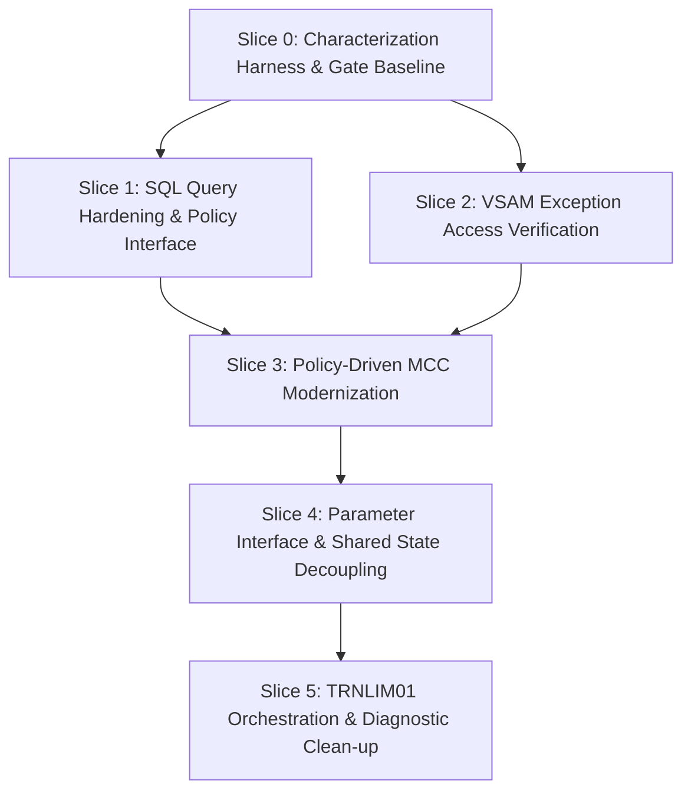

# Implementation Plan: AtlasPay Dynamic Transaction Limit Refactoring

**Stage:** PLAN  
**Run:** `run-003`  
**Document:** `01-implementation-plan.md` — Bounded Implementation Plan for Dynamic Transaction Limit Capability  
**Framework Stage:** PLAN (`framework-assets/playbooks/implementation-plan/playbook.yaml` v0.3.5)  
**Approved Disposition:** REFACTOR — APPROVED WITH CONDITIONS (`runs/atlaspay/decide/run-002/04-human-decision-gate.md`)  
**Human Plan Approver:** REQUIRED — NOT YET ASSIGNED  
**Approval Status:** PENDING HUMAN PLAN APPROVAL  
**Progression to TRANSFORM:** NOT AUTHORIZED  

---

## 1. Decision Traceability

This implementation plan directly operationalizes the human-approved modernization decision:

- **Approved Disposition:** `REFACTOR` (Approved with Conditions by Human Decision Owner Suman Devarasetti on 2026-09-19 in [`04-human-decision-gate.md`](runs/atlaspay/decide/run-002/04-human-decision-gate.md)).
- **Authoritative Decision Record:** [`03-modernization-decision-record-final.md`](runs/atlaspay/decide/run-002/03-modernization-decision-record-final.md).
- **Stated Business Objective:** *Make the Dynamic Transaction Limit capability easier and safer to evolve while preserving existing externally observable behavior unless a separately approved business-policy change authorizes a difference.*
- **Governance Alignment:**
  - Addresses the two primary sources of evolution friction identified in frozen UNDERSTAND evidence without platform migration or runtime changes:
    1. Hardcoded business-policy values embedded directly in executable logic (e.g. MCC limits in [`MERCHVAL.cbl:9-17`](src/cobol/MERCHVAL.cbl:9)).
    2. Shared mutable state and copybook coupling across 8 sub-programs mutating [`LIMITCTX.cpy`](src/copybooks/LIMITCTX.cpy).
  - Strictly preserves all 18 known unknowns as active constraints.
  - Imposes mandatory pre-implementation gates for characterization test authority, business policy intent confirmation, database query safety, and interface compatibility.

---

## 2. Plan Scope

The scope of this plan is strictly bounded to the internal restructuring of the AtlasPay Dynamic Transaction Limit capability within its existing z/OS CICS/COBOL/Db2 execution environment.

**In-Scope Activities:**
1. **Test Authority and Characterization Baseline:** Formally resolving KU-13 and establishing an automated, evidence-backed characterization test harness across all 25 business rules (BR-01 through BR-25) and fallback paths prior to any code alteration.
2. **Modular Parameter Encapsulation:** Refactoring the limit sub-programs to pass explicit, directional parameter interfaces (or scoped parameter blocks) rather than passing the global, fully mutable [`LIMITCTX.cpy`](src/copybooks/LIMITCTX.cpy) across all subroutines.
3. **MCC Policy Representation Modernization:** Transitioning MCC policy limits from hardcoded COBOL statements in [`MERCHVAL.cbl`](src/cobol/MERCHVAL.cbl) to an externalized or cleanly isolated policy lookup, conditioned on explicit human business confirmation.
4. **Data Access and Query Hardening:** Hardening SQL queries in [`LIMITPOL.cbl`](src/cobol/LIMITPOL.cbl) against multi-row ambiguity (`SQLCODE -811` / KU-07) and verifying VSAM runtime alignment in [`EXCEPT01.cbl`](src/cobol/EXCEPT01.cbl) (KU-11, KU-12).
5. **Orchestration Cleansing:** Eliminating redundant context re-initialization ([`TRNLIM01.cbl:10`](src/cobol/TRNLIM01.cbl:10)) and establishing clean, isolated invocation paths.

---

## 3. Explicit Out-of-Scope

To ensure non-regression, maintain architectural containment, and comply with DECIDE constraints, the following items are explicitly **OUT OF SCOPE**:

1. **No Code Modification During PLAN:** No production or test source in `src/`, `jcl/`, `db2/`, `vsam/`, `mq/`, or `cics/` will be altered during this stage.
2. **No EXTRACT or EXPOSE:** No external service extraction, microservice decomposition, REST/JSON API exposure, or adapter layer implementation.
3. **No TRANSFORM or Target Platform Selection:** No re-implementation in Java, Go, C#, Python, or cloud-native runtimes; no deployment to Linux, containers, or distributed cloud platforms.
4. **No REPLATFORM or Emulation:** No migration to alternative mainframe emulators or re-hosting platforms.
5. **No RETIRE:** No decommissioning of authorization or limit capabilities.
6. **No Unapproved Business Policy Alteration:**
   - No modification to the 7-step limit resolution sequence in [`LIMUTIL.cbl:12-46`](src/cobol/LIMUTIL.cbl:12).
   - No unilateral alteration of grandfathered exception overrides vs. product-max ceiling (C-02).
   - No runtime enforcement of `ER-EXPIRY-DATE` without explicit business/batch reconciliation alignment (C-03, KU-05, KU-06).
   - No removal or alteration of the 1,000.00 fallback limit floor (BR-04, C-05).
7. **No Direct Modification of External Systems:** No changes to the external MQ risk provider, core card database schemas outside limit policy, or CICS transaction definitions.

---

## 4. Preconditions

Before any change slice can transition from PLAN to TRANSFORM, the following technical and operational preconditions must be satisfied:

1. **Formal Human Plan Approval:** A designated Human Plan Approver must sign the Human Plan Gate in Section 13.
2. **Baseline Characterization Test Harness Active:** An automated execution environment must be established capable of executing characterization test suites and verifying binary parity across all 25 business rules.
3. **Data Dictionary Synchronization:** Complete data dictionary descriptions for all in-scope variables and copybooks in `bobz/DD.json`.
4. **Environment and Build Reproducibility:** Clean compile and link-edit JCL procedures verified for all COBOL artifacts (`ATLAUTH`, `TRNLIM01`, `LIMITPOL`, `EXCEPT01`, `TMPCTRL`, `MERCHVAL`, `CUSTRSK`, `RISKFBK`, `LIMUTIL`, `LIMITBAT`, `AUTHLOG`).

---

## 5. Sequenced Change Slices

The refactoring is decomposed into six bounded, sequentially ordered change slices. Each slice represents an atomic, testable, and independently reversible unit of work.



---

### Slice 0: Characterization Test Harness & KU-13 Authority Resolution

1. **Objective and Rationale:** Establish a deterministic, automated validation baseline. Resolve the high-risk branch conflict between characterization files to enable authoritative proof of behavioral equivalence.
2. **Traceability to REFACTOR Decision:** Condition 4 of [`04-human-decision-gate.md`](runs/atlaspay/decide/run-002/04-human-decision-gate.md) mandates KU-13 resolution before behavioral equivalence can be proven.
3. **Affected Artifacts:**
   - `tests/golden-master/cases.yaml` (Structured baseline)
   - `tests/golden-master-cases.yaml` (Conflicting legacy baseline)
   - `modernization/understand/run-001/03-business-rules-raw.md` (BR-13, BR-14, BR-15)
4. **Prerequisites:** Access to test repository and test execution toolchain.
5. **Known Unknowns Resolved Before Execution:**
   - **KU-13:** Human business/QA owner must formally confirm that `tests/golden-master/cases.yaml` (expecting 4,000.00 on risk score ≥ 800 via 20% reduction per [`LIMUTIL.cbl:33-34`](src/cobol/LIMUTIL.cbl:33)) is authoritative over `tests/golden-master-cases.yaml` (which expects 6,000.00).
6. **Dependency Ordering:** Sequence Position 0 (Must precede all source code slices).
7. **Behavioral Invariants:** Zero change to production source; 100% agreement with current compiled load modules across all 25 business rules.
8. **Evidence Required:**
   - *Before:* Discrepancy analysis matrix between test files.
   - *After:* Automated test run report confirming 100% pass rate against current unmodified COBOL binaries.
9. **Rollback Mechanism:** Discard test harness harness configuration; revert to baseline test definitions.
10. **Abort Criteria:** Inability to achieve 100% reproducible test passes against unmodified production binaries.
11. **Reversibility Classification:** High (Zero production impact).
12. **Required Human Checkpoint:** Sign-off on KU-13 resolution and characterization suite authority.

---

### Slice 1: Database Query Hardening & Policy Data Access Refactoring

1. **Objective and Rationale:** Protect [`LIMITPOL.cbl`](src/cobol/LIMITPOL.cbl) against runtime ambiguity (`SQLCODE -811`) and encapsulate Db2 access to ensure predictable base/jurisdiction limit retrieval.
2. **Traceability to REFACTOR Decision:** Condition 3 and Section 10 of [`03-modernization-decision-record-final.md`](runs/atlaspay/decide/run-002/03-modernization-decision-record-final.md) (KU-07, KU-08, KU-10, C-05).
3. **Affected Artifacts:**
   - [`src/cobol/LIMITPOL.cbl`](src/cobol/LIMITPOL.cbl)
   - [`src/copybooks/LIMITCTX.cpy`](src/copybooks/LIMITCTX.cpy)
   - `db2/schema.sql` (Reference schema verification)
   - [`jcl/LIMITREF.jcl`](jcl/LIMITREF.jcl) (Verification of batch execution mode)
4. **Prerequisites:** Slice 0 completed and verified.
5. **Known Unknowns Resolved Before Execution:**
   - **KU-07:** Clarify `ATLAS_LIMIT_POLICY` effective-date querying to prevent multi-row fetch exceptions or confirm singleton row guarantee.
   - **KU-08:** Confirm `POLREC.cpy` usage and verify no external unmapped batch dependencies.
   - **KU-10:** Confirm operational status of `LIMITREF.jcl` (whether a batch wrapper exists in production).
   - **C-05:** Confirm business intent of the 1,000.00 SQL fallback floor.
6. **Dependency Ordering:** Sequence Position 1 (Can execute in parallel with Slice 2).
7. **Behavioral Invariants:**
   - BR-03: `LC-BASE-LIMIT`, `LC-PRODUCT-MAX`, and `LC-JURIS-LIMIT` retrieved identically for all valid keys.
   - BR-04: Non-zero SQLCODE continues to yield 1,000.00 floor limit.
8. **Evidence Required:**
   - *Before:* SQL execution trace against current test database.
   - *After:* Query execution trace proving singleton fetch under multi-effective-date conditions with unchanged outputs.
9. **Rollback Mechanism:** Recompile and rebind original [`LIMITPOL.cbl`](src/cobol/LIMITPOL.cbl) load module.
10. **Abort Criteria:** Any divergence in returned limit values or SQL return codes during characterization execution.
11. **Reversibility Classification:** High (Standard load module re-link and Db2 package bind).
12. **Required Human Checkpoint:** Database Administrator and SME sign-off on SQL query structure and KU-07 handling.

---

### Slice 2: VSAM Exception Access Verification & Runtime Isolation

1. **Objective and Rationale:** Validate and isolate the exception override mechanism in [`EXCEPT01.cbl`](src/cobol/EXCEPT01.cbl) to guarantee deterministic VSAM access without altering unapproved expiry/reconciliation semantics.
2. **Traceability to REFACTOR Decision:** Condition 5 of [`04-human-decision-gate.md`](runs/atlaspay/decide/run-002/04-human-decision-gate.md) (protect exception semantics; KU-05, KU-06, KU-11, KU-12, C-02, C-03).
3. **Affected Artifacts:**
   - [`src/cobol/EXCEPT01.cbl`](src/cobol/EXCEPT01.cbl)
   - [`src/copybooks/EXCEPTREC.cpy`](src/copybooks/EXCEPTREC.cpy)
   - `vsam/DEFINE.jcl`
   - `vsam/synthetic-exceptions.csv`
4. **Prerequisites:** Slice 0 completed.
5. **Known Unknowns Resolved Before Execution:**
   - **KU-11:** Reconcile VSAM `RECORDSIZE(57 57)` vs. 58-byte `EXCEPTREC.cpy` layout.
   - **KU-12:** Verify CICS file-control compilation options (RENT/REUS/CICS translator settings) for native COBOL I/O.
   - **KU-05 / KU-06 / C-03:** Formally document that runtime `ER-EXPIRY-DATE` evaluation remains unchanged (bypassed online, managed by batch) unless human change approval is granted.
6. **Dependency Ordering:** Sequence Position 2 (Can execute in parallel with Slice 1).
7. **Behavioral Invariants:**
   - BR-08: Active exception (`ER-ACTIVE = 'Y'`) sets `LC-GRANDFATHERED := 'Y'` and assigns `LC-EXCEPTION-LIMIT := ER-EXCEPTION-LIMIT`.
   - BR-09: Inactive or missing record leaves `LC-GRANDFATHERED := 'N'`.
8. **Evidence Required:**
   - *Before:* VSAM read characterization trace across active, inactive, expired, and non-existent keys.
   - *After:* Identical read outputs and file status code assertions in target test environment.
9. **Rollback Mechanism:** Re-link previous `EXCEPT01` load module.
10. **Abort Criteria:** Any VSAM status error (e.g. Status 23 or file open failure) not handled gracefully per baseline.
11. **Reversibility Classification:** High (Load module rollback).
12. **Required Human Checkpoint:** Mainframe Systems Programmer / Data Admin verification of VSAM cluster definition and CICS table entry.

---

### Slice 3: Policy-Driven Merchant Category Code (MCC) Modernization

1. **Objective and Rationale:** Eliminate hardcoded business constants (1,000.00 for MCC 7995; 2,000.00 for MCC 6051) from executable logic in [`MERCHVAL.cbl`](src/cobol/MERCHVAL.cbl) by introducing an isolated, business-governed policy structure.
2. **Traceability to REFACTOR Decision:** Condition 2 of [`04-human-decision-gate.md`](runs/atlaspay/decide/run-002/04-human-decision-gate.md) and §5 of [`03-modernization-decision-record-final.md`](runs/atlaspay/decide/run-002/03-modernization-decision-record-final.md).
3. **Affected Artifacts:**
   - [`src/cobol/MERCHVAL.cbl`](src/cobol/MERCHVAL.cbl)
   - [`src/cobol/TRNLIM01.cbl`](src/cobol/TRNLIM01.cbl) (Interface review: `CALL 'MERCHVAL' USING AUTH-REQUEST LC-MCC-LIMIT`)
4. **Prerequisites:** Slices 0, 1, and explicit human business confirmation.
5. **Known Unknowns Resolved Before Execution:**
   - **Human Business Decision Gate:** Business confirmation whether MCC caps are regulatory/contractual constants (retained as code tables) or configurable business policy (externalized to policy table/copybook).
6. **Dependency Ordering:** Sequence Position 3 (Requires Slice 0 baseline and Slice 1 data architecture patterns).
7. **Behavioral Invariants:**
   - BR-10: MCC 7995 results in exactly 1,000.00 cap.
   - BR-11: MCC 6051 results in exactly 2,000.00 cap.
   - BR-12: Any other MCC code results in 9,999,999.99 (no cap).
8. **Evidence Required:**
   - *Before:* MCC test suite run across 7995, 6051, 5411, blank, and numeric edge cases.
   - *After:* 100% identical outputs for all MCC inputs.
9. **Rollback Mechanism:** Restore original [`MERCHVAL.cbl`](src/cobol/MERCHVAL.cbl) source and recompile.
10. **Abort Criteria:** Deviation in resolved MCC limit for any category code.
11. **Reversibility Classification:** High (Isolated module re-link).
12. **Required Human Checkpoint:** Business Policy Owner approval of MCC representation.

---

### Slice 4: Parameter Interface Encapsulation & Shared-State Decoupling

1. **Objective and Rationale:** Replace the monolithic, fully mutable [`LIMITCTX.cpy`](src/copybooks/LIMITCTX.cpy) shared across 8 sub-programs with explicit, directional parameter blocks, drastically reducing blast radius and coupling.
2. **Traceability to REFACTOR Decision:** Section 2.2 and Section 5 of [`03-modernization-decision-record-final.md`](runs/atlaspay/decide/run-002/03-modernization-decision-record-final.md).
3. **Affected Artifacts:**
   - [`src/copybooks/LIMITCTX.cpy`](src/copybooks/LIMITCTX.cpy) (Refactored or partitioned)
   - [`src/cobol/LIMITPOL.cbl`](src/cobol/LIMITPOL.cbl)
   - [`src/cobol/EXCEPT01.cbl`](src/cobol/EXCEPT01.cbl)
   - [`src/cobol/TMPCTRL.cbl`](src/cobol/TMPCTRL.cbl)
   - [`src/cobol/MERCHVAL.cbl`](src/cobol/MERCHVAL.cbl)
   - [`src/cobol/CUSTRSK.cbl`](src/cobol/CUSTRSK.cbl)
   - [`src/cobol/RISKFBK.cbl`](src/cobol/RISKFBK.cbl)
   - [`src/cobol/LIMUTIL.cbl`](src/cobol/LIMUTIL.cbl)
4. **Prerequisites:** Slices 0, 1, 2, 3 completed.
5. **Known Unknowns Resolved Before Execution:**
   - **KU-01:** Confirm MQ risk score fields (`LC-RISK-AVAILABLE`, `LC-RISK-SCORE`) are passed directionally without modifying MQ interface wrapper.
   - **KU-17:** Validate whether `CUSTRSK` remains called unconditionally in current orchestration or if formal short-circuiting requires business approval.
6. **Dependency Ordering:** Sequence Position 4 (Precedes orchestrator simplification).
7. **Behavioral Invariants:**
   - BR-06, BR-07: Temporary limits copied identically.
   - BR-13, BR-14, BR-15, BR-16-RISK, BR-17-RISK: Risk scoring and 650-fallback logic execute identically.
   - BR-18, BR-24: 7-step resolution sequence in `LIMUTIL` executes with identical arithmetic and precedence.
8. **Evidence Required:**
   - *Before:* Full parameter memory dumps across all sub-program boundaries.
   - *After:* Memory assertions proving individual sub-programs only mutate their designated output parameters.
9. **Rollback Mechanism:** Revert all sub-programs and copybooks to monolithic `LIMITCTX.cpy` baseline.
10. **Abort Criteria:** Memory corruption, parameter alignment mismatches, or calculation differences.
11. **Reversibility Classification:** High (Full sub-system load module re-link).
12. **Required Human Checkpoint:** Lead Mainframe Architect review of refactored parameter structures.

---

### Slice 5: TRNLIM01 Orchestrator Modernization & Diagnostic Path Validation

1. **Objective and Rationale:** Refactor [`TRNLIM01.cbl`](src/cobol/TRNLIM01.cbl) to coordinate the decoupled sub-programs cleanly, remove redundant context re-initializations, and ensure complete caller compatibility for both `ATLAUTH` (CICS `ATLA`) and direct diagnostic entry (CICS `ATLI`).
2. **Traceability to REFACTOR Decision:** Condition 1 and 4 of [`04-human-decision-gate.md`](runs/atlaspay/decide/run-002/04-human-decision-gate.md) (KU-03, KU-04, KU-09, KU-16).
3. **Affected Artifacts:**
   - [`src/cobol/TRNLIM01.cbl`](src/cobol/TRNLIM01.cbl)
   - [`src/cobol/ATLAUTH.cbl`](src/cobol/ATLAUTH.cbl)
   - `cics/transactions.yaml` (Verification of ATLA and ATLI entry points)
4. **Prerequisites:** Slices 0 through 4 completed.
5. **Known Unknowns Resolved Before Execution:**
   - **KU-03:** Clarify `AUTH-REQUEST` Linkage Section population when `TRNLIM01` is invoked via diagnostic transaction `ATLI`.
   - **KU-04 / KU-09:** Verify that `ATLAUTH` downstream fields (`AS-DECISION`, `AS-REASON-CODE`, `AS-APPLIED-LIMIT`) and audit logging remain 100% byte-for-byte compatible.
6. **Dependency Ordering:** Sequence Position 5 (Final integration slice).
7. **Behavioral Invariants:**
   - BR-19 through BR-22: `ATLAUTH` authorization decision (`A` vs. `D`) and reason codes (`0000` vs. `LIMT`) remain strictly invariant.
   - BR-23 through BR-25: Orchestration precedence preserved identically.
8. **Evidence Required:**
   - *Before:* End-to-end trace from `ATLA` and `ATLI` dispatches through `ATLAUTH` and `TRNLIM01`.
   - *After:* End-to-end test execution report covering full golden-master test catalog with zero discrepancies.
9. **Rollback Mechanism:** Re-link previous `TRNLIM01` and `ATLAUTH` binaries.
10. **Abort Criteria:** Any failure in diagnostic transaction `ATLI` or authorization transaction `ATLA`.
11. **Reversibility Classification:** High (Load module rollback).
12. **Required Human Checkpoint:** Application Owner and QA Lead final sign-off.

---

## 6. Artifact Impact Map

| Artifact | Type | Role in Current State | Refactoring Change Type | Slice | Reversibility |
|---|---|---|---|---|---|
| `tests/golden-master/cases.yaml` | Test | Golden-master characterization suite | Benchmark baseline authority | Slice 0 | High |
| `tests/golden-master-cases.yaml` | Test | Conflicting legacy test suite | Deprecated / superseded (KU-13) | Slice 0 | High |
| [`src/cobol/LIMITPOL.cbl`](src/cobol/LIMITPOL.cbl) | COBOL | Db2 policy retrieval | Query hardening; parameter scoping | Slice 1, 4 | High |
| `db2/schema.sql` | SQL | Db2 table definitions | No change (query alignment only) | Slice 1 | High |
| [`jcl/LIMITREF.jcl`](jcl/LIMITREF.jcl) | JCL | Anomaly batch touchpoint | Verified / documented (KU-10) | Slice 1 | High |
| [`src/cobol/EXCEPT01.cbl`](src/cobol/EXCEPT01.cbl) | COBOL | VSAM exception override lookup | VSAM I/O isolation; parameter scoping | Slice 2, 4 | High |
| [`src/copybooks/EXCEPTREC.cpy`](src/copybooks/EXCEPTREC.cpy) | Copybook | VSAM record layout | Verified / aligned with cluster (KU-11) | Slice 2 | High |
| [`src/cobol/MERCHVAL.cbl`](src/cobol/MERCHVAL.cbl) | COBOL | MCC cap evaluation | Policy encapsulation; constant decoupling | Slice 3, 4 | High |
| [`src/copybooks/LIMITCTX.cpy`](src/copybooks/LIMITCTX.cpy) | Copybook | Monolithic shared context | Partitioned / scoped interfaces | Slice 4 | High |
| [`src/cobol/TMPCTRL.cbl`](src/cobol/TMPCTRL.cbl) | COBOL | Temporary limit assignment | Parameter scoping | Slice 4 | High |
| [`src/cobol/CUSTRSK.cbl`](src/cobol/CUSTRSK.cbl) | COBOL | MQ risk score invocation | Parameter scoping (wrapper intact) | Slice 4 | High |
| [`src/cobol/RISKFBK.cbl`](src/cobol/RISKFBK.cbl) | COBOL | Fallback risk assignment | Parameter scoping | Slice 4 | High |
| [`src/cobol/LIMUTIL.cbl`](src/cobol/LIMUTIL.cbl) | COBOL | 7-step limit calculation | Clean parameter interface; invariant logic | Slice 4 | High |
| [`src/cobol/TRNLIM01.cbl`](src/cobol/TRNLIM01.cbl) | COBOL | Limit orchestrator | Orchestration clean-up; caller preservation | Slice 4, 5 | High |
| [`src/cobol/ATLAUTH.cbl`](src/cobol/ATLAUTH.cbl) | COBOL | CICS online auth orchestrator | Interface verification (`AS-APPLIED-LIMIT`) | Slice 5 | High |
| `cics/transactions.yaml` | CICS | Transaction routing (`ATLA`, `ATLI`) | Diagnostic caller verification | Slice 5 | High |

---

## 7. Known-Unknown Resolution Gates

No known unknown may be resolved by assumption. The following resolution gates must be formally cleared before the corresponding implementation slice can execute:

| Unknown ID | Description | Severity | Mandated Resolution Gate | Constrained Slices |
|---|---|---|---|---|
| **KU-13** | Golden master test conflict for risk score ≥ 800 (4,000.00 vs 6,000.00) | **HIGH** | Human QA/Business confirmation that 20% reduction (`LIMUTIL.cbl:33-34` ×0.80) is authoritative | **Slice 0 (Pre-requisite to all)** |
| **KU-07** | `ATLAS_LIMIT_POLICY` multi-row `SQLCODE -811` risk on non-unique effective date | **MEDIUM** | DB2 DBA confirmation of unique index or rewrite query with `ORDER BY EFFECTIVE_DATE DESC FETCH FIRST 1 ROW ONLY` | **Slice 1** |
| **KU-08** | `POLREC.cpy` consumer unmapped in workspace | **MEDIUM** | Source scanning across batch libraries to confirm `POLREC` is not an external binding dependency | **Slice 1** |
| **KU-10** | `LIMITREF.jcl` operational intent with batch entry in `LIMITPOL` | **LOW** | Mainframe Operations confirmation of production JCL catalog status | **Slice 1** |
| **KU-11** | VSAM `RECORDSIZE(57 57)` vs. 58-byte `EXCEPTREC.cpy` layout discrepancy | **MEDIUM** | IDCAMS cluster verification in target execution environment | **Slice 2** |
| **KU-12** | `EXCEPT01` native COBOL VSAM I/O compilation options under CICS | **HIGH** | CICS Systems Programmer confirmation of runtime file-control table / compiler options | **Slice 2** |
| **KU-05 / KU-06** | `EXCREC01` reconciliation logic & `ER-EXPIRY-DATE` runtime enforcement intent | **MEDIUM** | Business confirmation that online authorization intentionally ignores `ER-EXPIRY-DATE` (relying on batch reconciliation) | **Slice 2** |
| **KU-01** | `MQRSKGET` wrapper implementation details absent | **HIGH** | Maintain existing binary CALL interface; do not alter MQ parameters in `CUSTRSK` | **Slice 4** |
| **KU-17** | `CUSTRSK` unconditional invocation for grandfathered accounts | **LOW–MED** | Retain unconditional call during refactoring to preserve external MQ queue traffic invariants | **Slice 4** |
| **KU-03** | `AUTH-REQUEST` Linkage population for diagnostic CICS `ATLI` entry | **MEDIUM** | CICS trace analysis of `ATLI` commarea/container mapping to ensure dual-caller compatibility | **Slice 5** |
| **KU-04 / KU-09** | `AUTHLOG` real I/O destination & inert `AS-RISK-MODE` field in `AUTH-RESPONSE` | **HIGH** | Maintain byte-exact `AUTH-RESPONSE` layout and audit invocation timing in `ATLAUTH` | **Slice 5** |
| **KU-02 / KU-15 / KU-16** | Upstream `AUTH-REQUEST` population & inert `AR-TRANSACTION-TYPE` | **MEDIUM** | Preserve full `AUTHREQ.cpy` layout without field deletion or reordering | **Slice 5** |
| **KU-14 / KU-18** | `LIMITBAT` `LAST_REFRESH_TS` & `AUTHRPT` batch data source | **LOW** | Preserve batch JCL compatibility and schema column bindings | **Slice 1, 5** |

---

## 8. Behavioral Invariants

The refactored implementation must preserve all 25 cataloged business rules at 100% fidelity. Any divergence is considered a defect.

### 8.1 Pre-Limit & Orchestration Invariants
- **BR-01 (`ATLAUTH.cbl:16-21`):** Blank `AR-ACCOUNT-ID` terminates immediately with `AS-DECISION := 'D'` and `AS-REASON-CODE := 'INVA'`.
- **BR-02 (`ATLAUTH.cbl:24-29`):** Blank `AR-MERCHANT-CATEGORY` terminates immediately with `AS-DECISION := 'D'` and `AS-REASON-CODE := 'INVM'`.
- **BR-23 (`ATLAUTH.cbl:16-32`):** Account and merchant validations execute strictly prior to `TRNLIM01` invocation.
- **BR-25 (`TRNLIM01.cbl:12-22`):** Sub-programs are invoked in fixed sequence: `LIMITPOL` → `EXCEPT01` → `TMPCTRL` → `MERCHVAL` → `CUSTRSK` → `RISKFBK` (if risk unavailable) → `LIMUTIL`.

### 8.2 Limit Calculation & Precedence Invariants (LIMUTIL 7-Step Sequence)
- **BR-03 / BR-04 (`LIMITPOL.cbl:16-33`, `LIMUTIL.cbl:12`):** Candidate limit initialized to `LC-BASE-LIMIT` (or 1,000.00 fallback if Db2 lookup fails).
- **BR-05 (`LIMUTIL.cbl:14-17`):** If `LC-JURIS-LIMIT > 0` and `LC-JURIS-LIMIT < Candidate`, `Candidate := LC-JURIS-LIMIT`.
- **BR-10, BR-11, BR-12 (`MERCHVAL.cbl:9-17`, `LIMUTIL.cbl:19-22`):** If `LC-MCC-LIMIT > 0` and `LC-MCC-LIMIT < Candidate`, `Candidate := LC-MCC-LIMIT` (1,000.00 for 7995; 2,000.00 for 6051; 9,999,999.99 for all others).
- **BR-06, BR-07 (`TMPCTRL.cbl:12-16`, `LIMUTIL.cbl:24-27`):** If `LC-TEMP-LIMIT > 0` and `LC-TEMP-LIMIT < Candidate`, `Candidate := LC-TEMP-LIMIT`.
- **BR-08, BR-09 (`EXCEPT01.cbl:26-34`, `LIMUTIL.cbl:29-31`):** **Grandfathered Override:** If `LC-GRANDFATHERED = 'Y'`, `Candidate := LC-EXCEPTION-LIMIT` outright, bypassing steps 1–4 and risk adjustments.
- **BR-13, BR-14, BR-15 (`LIMUTIL.cbl:32-40`):** **Risk Adjustments (Non-grandfathered only):**
  - If `LC-RISK-SCORE >= 800`: `Candidate := Candidate * 0.80`.
  - If `LC-RISK-SCORE < 500`: `Candidate := Candidate * 0.70`.
  - If `500 <= LC-RISK-SCORE <= 799`: No adjustment.
- **BR-16-RISK, BR-17-RISK (`CUSTRSK.cbl:16-24`, `RISKFBK.cbl:10-13`):** If MQ risk service is unavailable (`LC-RISK-AVAILABLE != 'Y'`), fallback score `650` is applied deterministically.
- **BR-18 (`LIMUTIL.cbl:42-45`):** **Product Maximum Ceiling:** If `Candidate > LC-PRODUCT-MAX`, `Candidate := LC-PRODUCT-MAX`. (Applies unconditionally to all accounts, including grandfathered exceptions per current code).
- **BR-19, BR-20, BR-21, BR-22 (`ATLAUTH.cbl:33-47`):**
  - If `AR-AMOUNT <= LC-FINAL-LIMIT`: `AS-DECISION := 'A'`, `AS-REASON-CODE := '0000'`.
  - If `AR-AMOUNT > LC-FINAL-LIMIT`: `AS-DECISION := 'D'`, `AS-REASON-CODE := 'LIMT'`.
  - `AS-APPLIED-LIMIT := LC-FINAL-LIMIT` populated on all responses.
  - Audit logging performed unconditionally.

---

## 9. Validation / Proof Matrix

| Business Rule | Test Case ID | Test Input Characteristics | Expected Invariant Output | Slice Verified |
|---|---|---|---|---|
| **BR-01** | TC-AUTH-001 | Blank `AR-ACCOUNT-ID` | Decision: `D`, Reason: `INVA` | Slice 0, 5 |
| **BR-02** | TC-AUTH-002 | Blank `AR-MERCHANT-CATEGORY` | Decision: `D`, Reason: `INVM` | Slice 0, 5 |
| **BR-03** | TC-POL-001 | Standard Gold Account (US) | Base Limit: 5,000.00, Max: 10,000.00 | Slice 0, 1, 4 |
| **BR-04** | TC-POL-002 | Non-existent Product/Jurisdiction in Db2 | Base Limit: 1,000.00 (Fallback floor) | Slice 0, 1, 4 |
| **BR-05** | TC-JUR-001 | Standard Platinum Account (EU Juris Cap 3,000.00) | Candidate capped at 3,000.00 | Slice 0, 1, 4 |
| **BR-06, BR-07** | TC-TMP-001 | Temporary limit set to 1,500.00 | Candidate capped at 1,500.00 | Slice 0, 4 |
| **BR-08, BR-09** | TC-EXC-001 | Active Grandfathered Account (Exception: 25,000.00) | Overrides steps 1–4; Final: capped at Prod Max | Slice 0, 2, 4 |
| **BR-10** | TC-MCC-001 | Gambling MCC `7995` | Capped at 1,000.00 | Slice 0, 3, 4 |
| **BR-11** | TC-MCC-002 | Quasi-Cash / Crypto MCC `6051` | Capped at 2,000.00 | Slice 0, 3, 4 |
| **BR-12** | TC-MCC-003 | Standard Retail MCC `5411` | Capped at 9,999,999.99 (Unconstrained) | Slice 0, 3, 4 |
| **BR-13 (KU-13)** | TC-RSK-001 | Risk Score 850 (High Risk >= 800) | Candidate reduced by 20% (* 0.80) | Slice 0, 4 |
| **BR-14** | TC-RSK-002 | Risk Score 450 (Low Risk < 500) | Candidate reduced by 30% (* 0.70) | Slice 0, 4 |
| **BR-15** | TC-RSK-003 | Risk Score 650 (Medium Risk 500–799) | Candidate unchanged (* 1.00) | Slice 0, 4 |
| **BR-16-RISK** | TC-RSK-004 | MQ Timeout / Failure (`RISK-AVAILABLE = 'N'`) | Risk Score 650 applied; Result = GM-009 | Slice 0, 4 |
| **BR-18** | TC-MAX-001 | Resolved candidate exceeds `LC-PRODUCT-MAX` | Final Limit clamped to `LC-PRODUCT-MAX` | Slice 0, 4 |
| **BR-19** | TC-DEC-001 | `AR-AMOUNT` <= `LC-FINAL-LIMIT` | Decision: `A`, Reason: `0000`, `AS-APPLIED-LIMIT` | Slice 0, 5 |
| **BR-20** | TC-DEC-002 | `AR-AMOUNT` > `LC-FINAL-LIMIT` | Decision: `D`, Reason: `LIMT`, `AS-APPLIED-LIMIT` | Slice 0, 5 |
| **Dual Callers** | TC-INT-001 | CICS `ATLA` online auth & `ATLI` diagnostic call | Successful limit generation for both paths | Slice 0, 5 |

---

## 10. Rollback and Abort Plan

### 10.1 Rollback Mechanisms by Slice
Because the refactoring is strictly internal to the COBOL sub-system on the existing z/OS environment, rollback operates via proven load module replacement:

- **Slices 1, 2, 3, 4, 5 Rollback:**
  1. Retrieve baseline load modules from the pre-TRANSFORM archive library (`ATLAPAY.LOAD.BACKUP`).
  2. Copy baseline load modules into the active execution load library (`ATLAPAY.LOAD`).
  3. Issue CICS Program Newcopy commands for affected modules:
     ```
     CEMT SET PROGRAM(ATLAUTH) NEWCOPY
     CEMT SET PROGRAM(TRNLIM01) NEWCOPY
     CEMT SET PROGRAM(LIMITPOL) NEWCOPY
     CEMT SET PROGRAM(EXCEPT01) NEWCOPY
     CEMT SET PROGRAM(MERCHVAL) NEWCOPY
     CEMT SET PROGRAM(LIMUTIL) NEWCOPY
     ```
  4. Verify system restoration using the automated Slice 0 characterization test suite.

### 10.2 Global Abort Criteria
The implementation must be immediately aborted and rolled back if any of the following conditions occur:

1. **Characterization Divergence:** A single test failure occurs during post-slice execution against the characterization baseline.
2. **Online Abends:** Any CICS abend (e.g., `ASRA`, `AEIM`, `AEY9`) detected during integration testing or verification runs.
3. **Unresolved Unknown Violation:** Any slice attempts to circumvent a mandatory resolution gate or implement an unapproved assumption.
4. **Batch Schedule Degradation / Lock Contention:** Deadlocks or dataset contention observed between online CICS transactions and batch jobs (`LIMREFR`, `LIMITBKP`, `EXCRECON`).

---

## 11. Risk Register

| Risk ID | Risk Description | Severity | Likelihood | Mitigation Strategy |
|---|---|---|---|---|
| **RSK-01** | Parameter structure mismatch across sub-program boundaries causing memory overlay | **HIGH** | Low | Strict copybook structure alignment; Slice 4 memory dump verification; automated parameter layout validation. |
| **RSK-02** | Incomplete resolution of KU-13 leads to deploying wrong risk calculation logic | **HIGH** | Low | Mandatory Slice 0 human sign-off gate before any code refactoring begins. |
| **RSK-03** | CICS transaction `ATLI` fails due to Linkage Section parameter refactoring | **MEDIUM** | Medium | Maintain dual-caller compatibility tests in Slice 5; test `ATLI` independently in non-production region. |
| **RSK-04** | Db2 SQL query change causes unexpected access path or table scan | **MEDIUM** | Low | DBA review of EXPLAIN output during Slice 1; index validation on `(PRODUCT_CODE, JURISDICTION, EFFECTIVE_DATE)`. |
| **RSK-05** | Latent VSAM file lock contention with batch backup `LIMITBKP.jcl` | **MEDIUM** | Low | Validate VSAM SHAREOPTIONS and CICS File Control parameters during Slice 2. |

---

## 12. PLAN Exit Criteria

The PLAN stage is successfully completed and ready for TRANSFORM transition when and only when all of the following conditions are satisfied:

1. [x] Implementation plan is fully documented, bounded, and traced to the approved REFACTOR decision record.
2. [x] All 6 change slices are sequenced with explicit prerequisites, invariants, rollback mechanisms, and abort criteria.
3. [x] All 18 known unknowns from UNDERSTAND are accounted for and assigned to mandatory pre-implementation resolution gates.
4. [x] Proof matrix maps all 25 cataloged business rules to automated characterization test obligations.
5. [x] Zero application source code modifications have been made during the PLAN stage.
6. [ ] Formal human sign-off recorded on the Human Plan Gate (Section 13).

---

## 13. Human Plan Gate

As mandated by Agentic Strangler Governance and the Implementation Planning Playbook (`framework-assets/playbooks/implementation-plan/playbook.yaml`):

```yaml
Human Plan Approver: REQUIRED — NOT YET ASSIGNED
Approval Status: PENDING HUMAN PLAN APPROVAL
Date Assigned: PENDING
Progression to TRANSFORM: NOT AUTHORIZED
Source Modification Authorized: FALSE
Implementation Authorized: FALSE
```

**Mandatory Governance Rule:** No progression to TRANSFORM, no source code modification, and no execution of refactoring change slices is permitted until a named Human Plan Approver reviews this implementation plan and explicitly records an approved gate result.
