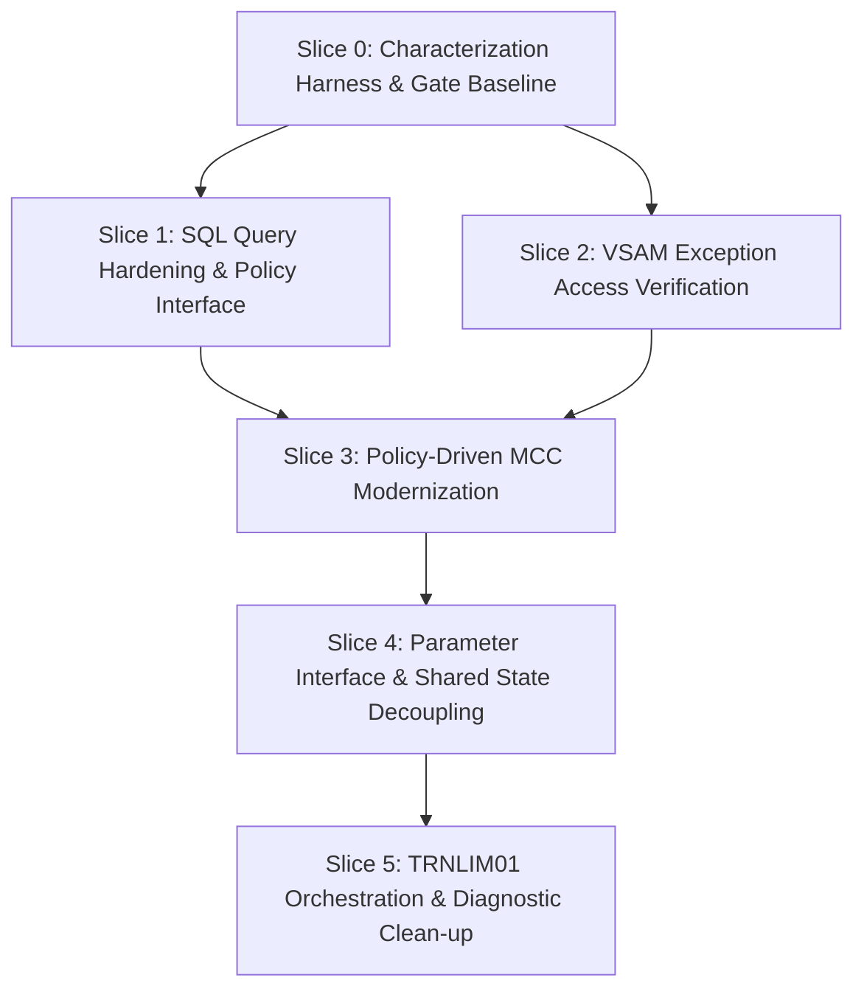

# Implementation Plan: AtlasPay Dynamic Transaction Limit Refactoring

**Stage:** PLAN  
**Run:** `run-003`  
**Document:** `02-implementation-plan-reviewed.md` — Governance/Evidence Review of the Bounded Implementation Plan  
**Framework Stage:** PLAN (`framework-assets/playbooks/implementation-plan/playbook.yaml` v0.3.5)  
**Approved Disposition:** REFACTOR — APPROVED WITH CONDITIONS (`runs/atlaspay/decide/run-002/04-human-decision-gate.md`)  
**Human Plan Approver:** REQUIRED — NOT YET ASSIGNED  
**Approval Status:** PENDING HUMAN PLAN APPROVAL  
**Progression to TRANSFORM:** NOT AUTHORIZED  

## Governance Review Notice

This document preserves the six-slice PLAN structure and the approved **REFACTOR** disposition, but corrects unsupported runtime/build assumptions and known-unknown handling from `01-implementation-plan.md`.

Key corrections:
- no mandatory `DD.json` dependency in workspace mode;
- no assumption that AtlasPay is currently buildable/executable or has verified load modules, runtime regions, deployment libraries, or rollback procedures;
- KU-05/KU-06 and KU-07 remain evidence/business-rule gates rather than being resolved by assumed implementations;
- MCC policy representation is conditional on human-confirmed business intent;
- KU-13 remains unresolved until human authority selects the expected behavior;
- known unknowns are classified as either **RESOLUTION GATES** or **CONTAINMENT GATES**;
- rollback is expressed as an evidence contract until an authorized execution environment establishes the real mechanism.

No new disposition, target technology, runtime fact, or business-policy decision is introduced.

---

## 1. Decision Traceability

This implementation plan directly operationalizes the human-approved modernization decision:

- **Approved Disposition:** `REFACTOR` (Approved with Conditions by Human Decision Owner Suman Devarasetti on 2026-09-19 in [`04-human-decision-gate.md`](runs/atlaspay/decide/run-002/04-human-decision-gate.md)).
- **Authoritative Decision Record:** [`03-modernization-decision-record-final.md`](runs/atlaspay/decide/run-002/03-modernization-decision-record-final.md).
- **Stated Business Objective:** *Make the Dynamic Transaction Limit capability easier and safer to evolve while preserving existing externally observable behavior unless a separately approved business-policy change authorizes a difference.*
- **Governance Alignment:**
  - Addresses the two primary sources of evolution friction identified in frozen UNDERSTAND evidence without platform migration or runtime changes:
    1. Hardcoded business-policy values embedded directly in executable logic (e.g. MCC limits in [`MERCHVAL.cbl:9-17`](src/cobol/MERCHVAL.cbl:9)).
    2. Shared mutable state and copybook coupling across 8 sub-programs mutating [`LIMITCTX.cpy`](src/copybooks/LIMITCTX.cpy).
  - Strictly preserves all 18 known unknowns as active constraints.
  - Imposes mandatory pre-implementation gates for characterization test authority, business policy intent confirmation, database query safety, and interface compatibility.

---

## 2. Plan Scope

The scope of this plan is strictly bounded to the internal restructuring of the AtlasPay Dynamic Transaction Limit capability within its existing z/OS CICS/COBOL/Db2 execution environment.

**In-Scope Activities:**
1. **Test Authority and Characterization Baseline:** Resolve KU-13 through human QA/business authority and establish an evidence-backed characterization baseline before any source alteration. Execution-based characterization is required before TRANSFORM if an authorized executable environment exists or is established.
2. **Modular Parameter Encapsulation:** Plan a reduction in broad shared-state coupling around [`LIMITCTX.cpy`](src/copybooks/LIMITCTX.cpy) while preserving all behaviorally load-bearing interfaces and call ordering. Exact parameter structures are a TRANSFORM design detail.
3. **MCC Policy Intent and Structural Refactoring:** Determine whether MCC 7995 and 6051 values are regulatory/contractual constants, intentionally code-controlled values, or configurable business policy. Only if configurability is explicitly approved may PLAN define representation options; otherwise the values remain unchanged and only structural cleanup may be considered.
4. **Data Access and Query Hardening:** Resolve the business/data rule behind possible multi-row `ATLAS_LIMIT_POLICY` results (KU-07) before selecting any SQL implementation. Verify VSAM record/runtime assumptions (KU-11, KU-12) before planning executable changes to `EXCEPT01`.
5. **Orchestration Review:** Review duplicate context initialization and invocation boundaries for simplification opportunities while preserving current caller compatibility and observable behavior. No initialization or call-order change is assumed safe by default.

---

## 3. Explicit Out-of-Scope

To ensure non-regression, maintain architectural containment, and comply with DECIDE constraints, the following items are explicitly **OUT OF SCOPE**:

1. **No Code Modification During PLAN:** No production or test source in `src/`, `jcl/`, `db2/`, `vsam/`, `mq/`, or `cics/` will be altered during this stage.
2. **No EXTRACT or EXPOSE:** No external service extraction, microservice decomposition, REST/JSON API exposure, or adapter layer implementation.
3. **No TRANSFORM or Target Platform Selection:** No re-implementation in Java, Go, C#, Python, or cloud-native runtimes; no deployment to Linux, containers, or distributed cloud platforms.
4. **No REPLATFORM or Emulation:** No migration to alternative mainframe emulators or re-hosting platforms.
5. **No RETIRE:** No decommissioning of authorization or limit capabilities.
6. **No Unapproved Business Policy Alteration:**
   - No modification to the 7-step limit resolution sequence in [`LIMUTIL.cbl:12-46`](src/cobol/LIMUTIL.cbl:12).
   - No unilateral alteration of grandfathered exception overrides vs. product-max ceiling (C-02).
   - No runtime enforcement of `ER-EXPIRY-DATE` without explicit business/batch reconciliation alignment (C-03, KU-05, KU-06).
   - No removal or alteration of the 1,000.00 fallback limit floor (BR-04, C-05).
7. **No Direct Modification of External Systems:** No changes to the external MQ risk provider, core card database schemas outside limit policy, or CICS transaction definitions.

---

## 4. Preconditions

Before any change slice can transition from PLAN to TRANSFORM, the following technical and governance preconditions must be satisfied:

1. **Formal Human Plan Approval:** A designated Human Plan Approver must sign the Human Plan Gate in Section 13.
2. **Authoritative Characterization Expectations:** KU-13 and any other conflicting expected behaviors needed by the selected slices must be resolved by the appropriate human authority.
3. **Characterization Capability:** Before executable refactoring begins, an authorized environment must exist that can run the agreed characterization checks against the unmodified baseline. If no executable environment is available, TRANSFORM remains blocked.
4. **Data Dictionary — Optional:** Use a native data dictionary if one is available in the authorized PP4Z environment. `DD.json` is not a prerequisite for this workspace-mode experiment and must not be fabricated.
5. **Execution-Environment Validation Gate:** AtlasPay is an analysis-grade synthetic estate and is not currently proven buildable or executable in a real z/OS environment. Before TRANSFORM execution, the actual compile/build, deploy, restore, runtime, and rollback mechanisms must be identified and successfully validated in an authorized environment.

---

## 5. Sequenced Change Slices

The refactoring is decomposed into six bounded, sequentially ordered change slices. Each slice represents an atomic, testable, and independently reversible unit of work.



---

### Slice 0: Characterization Baseline & KU-13 Authority Resolution

1. **Objective and Rationale:** Establish authoritative expected behavior and a reproducible characterization baseline before any source change.
2. **Traceability to REFACTOR Decision:** Condition 4 of [`04-human-decision-gate.md`](runs/atlaspay/decide/run-002/04-human-decision-gate.md) requires KU-13 resolution before behavioral equivalence can be formally proven.
3. **Affected Artifacts:**
   - `tests/golden-master/cases.yaml` (conflicting evidence set)
   - `tests/golden-master-cases.yaml` (conflicting evidence set)
   - `runs/atlaspay/understand/run-001/03-business-rules-raw.md` (BR-13, BR-14, BR-15)
4. **Prerequisites:** Human QA/business authority for the disputed behavior; access to an authorized execution environment is required before execution-based proof.
5. **Resolution Gate:**
   - **KU-13:** A human QA/business owner must determine the authoritative expected behavior for risk score ≥ 800. Neither test file is treated as canonical, deprecated, or superseded until that decision is recorded.
6. **Dependency Ordering:** Sequence Position 0; this precedes every executable source-change slice.
7. **Behavioral Invariants:** No production/source behavior changes in this slice. The baseline records observed current behavior and human-approved expected behavior where conflicts existed.
8. **Evidence Required:**
   - *Before:* Discrepancy matrix identifying all conflicting expected results and their source evidence.
   - *After:* Human decision record for KU-13; when an authorized executable environment is available, a reproducible baseline run against the unmodified implementation.
9. **Rollback Mechanism:** Remove or revert only the characterization configuration/artifacts created by this slice. No application rollback is required because no application source is changed.
10. **Abort Criteria:** Inability to establish authoritative expected behavior for a conflict required by later slices, or inability to establish a reproducible executable baseline before TRANSFORM.
11. **Reversibility Classification:** High; source behavior is unchanged.
12. **Required Human Checkpoint:** QA/business sign-off on the KU-13 decision and characterization authority.

---

### Slice 1: Database Query Semantics & Policy Data Access Refactoring

1. **Objective and Rationale:** Remove ambiguity around `ATLAS_LIMIT_POLICY` retrieval and plan a behavior-preserving refactor of policy data access only after the applicable-row rule is established.
2. **Traceability to REFACTOR Decision:** KU-07, KU-08, KU-10, and C-05 carried forward by the final DECIDE record and human gate.
3. **Affected Artifacts:**
   - [`src/cobol/LIMITPOL.cbl`](src/cobol/LIMITPOL.cbl)
   - [`src/copybooks/LIMITCTX.cpy`](src/copybooks/LIMITCTX.cpy)
   - `db2/schema.sql`
   - [`jcl/LIMITREF.jcl`](jcl/LIMITREF.jcl)
4. **Prerequisites:** Slice 0 complete; authorized database/runtime evidence available before execution-based validation.
5. **Resolution Gates:**
   - **KU-07:** Either prove the production data model guarantees a singleton row for the current predicate, **or** obtain an approved deterministic business rule for selecting the applicable effective-date row. Only after that may TRANSFORM select SQL syntax.
   - **KU-08:** Determine whether `POLREC.cpy` has consumers outside the isolated workspace before schema/interface changes.
   - **KU-10:** Establish the operational status and intended execution model of `LIMITREF.jcl`.
   - **C-05:** Confirm the business intent of the 1,000.00 non-zero-SQLCODE fallback before changing fallback semantics.
6. **Dependency Ordering:** Sequence Position 1; may proceed in parallel with Slice 2 after Slice 0.
7. **Behavioral Invariants:** Preserve current retrieved values and current fallback behavior unless a separately approved business decision explicitly changes them.
8. **Evidence Required:**
   - *Before:* Data-model constraints, representative policy rows, and approved applicable-row semantics.
   - *After:* In an authorized environment, evidence that the selected query behavior returns the approved row deterministically and does not alter approved outputs.
9. **Rollback Contract:** Maintain a restorable pre-change source/configuration baseline for `LIMITPOL` and any associated binding/configuration artifacts. The actual build/deploy/restore procedure remains UNKNOWN until validated in the authorized execution environment.
10. **Abort Criteria:** Any unapproved change to returned limit values, fallback behavior, or applicable-row semantics.
11. **Reversibility Classification:** High at source/configuration level; runtime rollback confidence is pending execution-environment validation.
12. **Required Human Checkpoint:** DBA/data owner plus business/SME approval of the applicable-row rule and fallback intent.

---

### Slice 2: VSAM Exception Evidence & Runtime Compatibility

1. **Objective and Rationale:** Validate exception-record structure and runtime compatibility without silently changing exception-expiry or reconciliation semantics.
2. **Traceability to REFACTOR Decision:** Human-gate conditions protecting KU-05, KU-06, KU-11, KU-12, C-02, and C-03.
3. **Affected Artifacts:**
   - [`src/cobol/EXCEPT01.cbl`](src/cobol/EXCEPT01.cbl)
   - [`src/copybooks/EXCEPTREC.cpy`](src/copybooks/EXCEPTREC.cpy)
   - `vsam/DEFINE.jcl`
   - `vsam/synthetic-exceptions.csv`
4. **Prerequisites:** Slice 0 complete.
5. **Resolution Gates:**
   - **KU-11:** Reconcile the VSAM record-size definition with the copybook layout and validate the actual runtime representation before executable change.
   - **KU-12:** Establish whether and how `EXCEPT01` is buildable/executable in the authorized CICS environment; required compiler/runtime options are evidence to be collected, not assumed.
   - **KU-05 / KU-06 / C-03:** Obtain business/operations evidence establishing whether `ER-EXPIRY-DATE` enforcement belongs in online authorization, batch reconciliation, or another process. Until resolved, preserve observed current behavior and do not introduce expiry enforcement.
6. **Dependency Ordering:** Sequence Position 2; may proceed in parallel with Slice 1 after Slice 0.
7. **Behavioral Invariants:** Preserve observed active/inactive exception behavior and grandfathered-limit behavior unless an explicitly approved policy decision changes it.
8. **Evidence Required:**
   - *Before:* Record-layout reconciliation and documented current behavior for active, inactive, expired, and missing records.
   - *After:* In an authorized runtime, repeatable evidence that record access and status handling match the approved baseline.
9. **Rollback Contract:** Maintain restorable pre-change source/configuration for `EXCEPT01`, copybooks, and any affected dataset definition. Environment-specific restore steps remain UNKNOWN until validated.
10. **Abort Criteria:** Any unapproved change to exception eligibility, record interpretation, or observed access behavior.
11. **Reversibility Classification:** High at source/configuration level; runtime rollback confidence is pending environment validation.
12. **Required Human Checkpoint:** Business/operations owner for expiry semantics plus the technical owner responsible for VSAM/CICS runtime evidence.

---

### Slice 3: MCC Policy-Intent Gate & Conditional Structural Refactoring

1. **Objective and Rationale:** Determine the intended governance of MCC 7995 and 6051 values before deciding whether representation should change. Avoid turning hardcoded values into configurable policy without explicit business authority.
2. **Traceability to REFACTOR Decision:** Condition 2 of [`04-human-decision-gate.md`](runs/atlaspay/decide/run-002/04-human-decision-gate.md).
3. **Affected Artifacts:**
   - [`src/cobol/MERCHVAL.cbl`](src/cobol/MERCHVAL.cbl)
   - [`src/cobol/TRNLIM01.cbl`](src/cobol/TRNLIM01.cbl) for interface compatibility review only
4. **Prerequisites:** Slice 0 complete and explicit human business confirmation of MCC policy intent.
5. **Resolution Gate:**
   - Human business owner must classify the values as regulatory/contractual constants, intentionally code-controlled values, or configurable business policy.
   - If configurability is approved, PLAN may define representation options; no specific table/copybook/configuration mechanism is preselected.
   - If configurability is not approved, preserve the values and limit this slice to structural refactoring only where justified.
6. **Dependency Ordering:** Sequence Position 3. No dependency on a predetermined Slice 1 data-architecture pattern.
7. **Behavioral Invariants:** Preserve observed outputs for MCC 7995, MCC 6051, and other MCC values unless a separately approved business-policy decision changes them.
8. **Evidence Required:**
   - *Before:* Human policy-intent decision plus characterization cases for the observed MCC behavior.
   - *After:* Evidence that observed outputs remain unchanged unless the business decision explicitly authorizes a difference.
9. **Rollback Contract:** Preserve a restorable pre-change `MERCHVAL` source/configuration baseline; environment-specific build/deploy/restore steps remain UNKNOWN until validated.
10. **Abort Criteria:** Any representation change attempted before policy intent is approved, or any unapproved change in MCC behavior.
11. **Reversibility Classification:** High at source/configuration level; runtime rollback confidence is pending environment validation.
12. **Required Human Checkpoint:** Business Policy Owner approval of MCC policy intent and any permitted representation change.

---

### Slice 4: Parameter Interface Encapsulation & Shared-State Decoupling

1. **Objective and Rationale:** Reduce unnecessary shared-state coupling around [`LIMITCTX.cpy`](src/copybooks/LIMITCTX.cpy) while preserving current interfaces and behavior unless a specific interface change is separately justified.
2. **Traceability to REFACTOR Decision:** Final DECIDE record and human gate identifying broad shared mutable context as a structural friction point.
3. **Affected Artifacts:**
   - [`src/copybooks/LIMITCTX.cpy`](src/copybooks/LIMITCTX.cpy)
   - [`src/cobol/LIMITPOL.cbl`](src/cobol/LIMITPOL.cbl)
   - [`src/cobol/EXCEPT01.cbl`](src/cobol/EXCEPT01.cbl)
   - [`src/cobol/TMPCTRL.cbl`](src/cobol/TMPCTRL.cbl)
   - [`src/cobol/MERCHVAL.cbl`](src/cobol/MERCHVAL.cbl)
   - [`src/cobol/CUSTRSK.cbl`](src/cobol/CUSTRSK.cbl)
   - [`src/cobol/RISKFBK.cbl`](src/cobol/RISKFBK.cbl)
   - [`src/cobol/LIMUTIL.cbl`](src/cobol/LIMUTIL.cbl)
4. **Prerequisites:** Slice 0 complete; any earlier slice whose artifacts overlap the selected interface change must have its gates satisfied.
5. **Containment Gates:**
   - **KU-01:** May remain unresolved if the MQ call contract, parameters, fallback triggering, and invocation behavior are left unchanged.
   - **KU-17:** May remain unresolved if the current unconditional `CUSTRSK` invocation order is preserved. Any optimization/short-circuit requires separate business/behavior approval.
6. **Dependency Ordering:** Sequence Position 4; precedes Slice 5 only if `TRNLIM01` integration must change.
7. **Behavioral Invariants:** Preserve temporary-limit behavior, risk/fallback behavior, calculation order, and all current outputs unless an approved policy change says otherwise.
8. **Evidence Required:**
   - *Before:* Static interface/copybook usage map; where executable runtime exists, baseline parameter observations.
   - *After:* Static evidence that write/read responsibilities are narrowed as intended, plus runtime equivalence evidence in an authorized executable environment before production readiness.
9. **Rollback Contract:** Preserve restorable pre-change source/copybook versions for every affected program. Runtime restore steps remain UNKNOWN until validated in the execution environment.
10. **Abort Criteria:** Any parameter-layout incompatibility, calculation difference, or need to alter the MQ contract/call ordering without clearing the relevant gate.
11. **Reversibility Classification:** High at source level; runtime rollback confidence is pending environment validation.
12. **Required Human Checkpoint:** Lead architect review of interface boundaries and containment-gate compliance.

---

### Slice 5: TRNLIM01 Orchestrator & Dual-Caller Compatibility

1. **Objective and Rationale:** Integrate approved internal refactoring while preserving compatibility for both `ATLAUTH` and the diagnostic `ATLI` path.
2. **Traceability to REFACTOR Decision:** Human-gate constraints covering KU-03, KU-04, KU-09, KU-16 and preservation of caller/interface behavior.
3. **Affected Artifacts:**
   - [`src/cobol/TRNLIM01.cbl`](src/cobol/TRNLIM01.cbl)
   - [`src/cobol/ATLAUTH.cbl`](src/cobol/ATLAUTH.cbl)
   - `cics/transactions.yaml` for routing evidence
4. **Prerequisites:** Prior selected refactoring slices complete and their gates satisfied.
5. **Resolution / Containment Gates:**
   - **KU-03 — RESOLUTION GATE:** Establish how `AUTH-REQUEST` is populated for the `ATLI` diagnostic path before changing the `TRNLIM01` interface.
   - **KU-04 — CONTAINMENT GATE:** May remain unresolved if audit invocation/interface behavior is not changed. Any audit timing, destination, or payload change requires resolution first.
   - **KU-09 — CONTAINMENT GATE:** Preserve current response layout and `AS-RISK-MODE` behavior unless a separate approved change resolves its intended semantics.
   - **KU-16 — CONTAINMENT GATE:** Preserve `AR-TRANSACTION-TYPE` layout/behavior unless its intent is explicitly resolved.
6. **Dependency Ordering:** Sequence Position 5; final integration slice.
7. **Behavioral Invariants:** Preserve authorization decisions, reason codes, applied-limit behavior, orchestration ordering where load-bearing, and both caller paths.
8. **Evidence Required:**
   - *Before:* Static call/interface evidence for `ATLAUTH`, `TRNLIM01`, and `ATLI`; runtime traces only if available in an authorized environment.
   - *After:* End-to-end equivalence evidence for both callers in an authorized executable environment before production readiness.
9. **Rollback Contract:** Preserve restorable pre-change source/configuration for `TRNLIM01`, `ATLAUTH`, and any affected interface artifacts. Runtime restore procedure remains UNKNOWN until validated.
10. **Abort Criteria:** Any caller incompatibility or unapproved behavioral difference.
11. **Reversibility Classification:** High at source/configuration level; runtime rollback confidence is pending environment validation.
12. **Required Human Checkpoint:** Application Owner and QA Lead review.

---

## 6. Artifact Impact Map

| Artifact | Type | Role in Current State | Refactoring Change Type | Slice | Reversibility |
|---|---|---|---|---|---|
| `tests/golden-master/cases.yaml` | Test | Conflicting characterization evidence | Authority pending KU-13 human decision | Slice 0 | High |
| `tests/golden-master-cases.yaml` | Test | Conflicting characterization evidence | Authority pending KU-13 human decision | Slice 0 | High |
| [`src/cobol/LIMITPOL.cbl`](src/cobol/LIMITPOL.cbl) | COBOL | Db2 policy retrieval | Query hardening; parameter scoping | Slice 1, 4 | High |
| `db2/schema.sql` | SQL | Db2 table definitions | No change (query alignment only) | Slice 1 | High |
| [`jcl/LIMITREF.jcl`](jcl/LIMITREF.jcl) | JCL | Anomaly batch touchpoint | Verified / documented (KU-10) | Slice 1 | High |
| [`src/cobol/EXCEPT01.cbl`](src/cobol/EXCEPT01.cbl) | COBOL | VSAM exception override lookup | VSAM I/O isolation; parameter scoping | Slice 2, 4 | High |
| [`src/copybooks/EXCEPTREC.cpy`](src/copybooks/EXCEPTREC.cpy) | Copybook | VSAM record layout | Reconcile with dataset definition (KU-11); no alignment assumed | Slice 2 | High |
| [`src/cobol/MERCHVAL.cbl`](src/cobol/MERCHVAL.cbl) | COBOL | MCC cap evaluation | Conditional structural refactor; policy representation only if approved | Slice 3, 4 | High |
| [`src/copybooks/LIMITCTX.cpy`](src/copybooks/LIMITCTX.cpy) | Copybook | Monolithic shared context | Partitioned / scoped interfaces | Slice 4 | High |
| [`src/cobol/TMPCTRL.cbl`](src/cobol/TMPCTRL.cbl) | COBOL | Temporary limit assignment | Parameter scoping | Slice 4 | High |
| [`src/cobol/CUSTRSK.cbl`](src/cobol/CUSTRSK.cbl) | COBOL | MQ risk score invocation | Parameter scoping (wrapper intact) | Slice 4 | High |
| [`src/cobol/RISKFBK.cbl`](src/cobol/RISKFBK.cbl) | COBOL | Fallback risk assignment | Parameter scoping | Slice 4 | High |
| [`src/cobol/LIMUTIL.cbl`](src/cobol/LIMUTIL.cbl) | COBOL | 7-step limit calculation | Clean parameter interface; invariant logic | Slice 4 | High |
| [`src/cobol/TRNLIM01.cbl`](src/cobol/TRNLIM01.cbl) | COBOL | Limit orchestrator | Orchestration clean-up; caller preservation | Slice 4, 5 | High |
| [`src/cobol/ATLAUTH.cbl`](src/cobol/ATLAUTH.cbl) | COBOL | CICS online auth orchestrator | Interface verification (`AS-APPLIED-LIMIT`) | Slice 5 | High |
| `cics/transactions.yaml` | CICS | Transaction routing (`ATLA`, `ATLI`) | Diagnostic caller verification | Slice 5 | High |

---

## 7. Known-Unknown Resolution and Containment Gates

No known unknown may be resolved by assumption.

Two gate types apply:

- **RESOLUTION GATE:** the unknown must be resolved by evidence or human authority before the constrained change can execute.
- **CONTAINMENT GATE:** the unknown may remain open only if the plan deliberately avoids changing the behavior/interface affected by that unknown.

| Unknown ID | Description | Gate Type | Mandated Gate | Constrained Slices |
|---|---|---|---|---|
| **KU-13** | Conflicting high-risk characterization expectations | **RESOLUTION** | Human QA/business authority selects the expected behavior; neither test file is canonical beforehand | **Slice 0; prerequisite to executable source slices** |
| **KU-07** | Possible multi-row `ATLAS_LIMIT_POLICY` result / `SQLCODE -811` | **RESOLUTION** | Prove singleton guarantee **or** approve a deterministic applicable-row business rule before SQL design | **Slice 1** |
| **KU-08** | `POLREC.cpy` consumer unmapped | **RESOLUTION** | Search authorized batch/source libraries before schema/interface change | **Slice 1** |
| **KU-10** | `LIMITREF.jcl` operational intent unknown | **RESOLUTION** | Operations evidence establishes whether/how it executes | **Slice 1** |
| **KU-11** | VSAM record-size discrepancy | **RESOLUTION** | Reconcile source definitions and validate actual runtime representation before VSAM-structure change | **Slice 2** |
| **KU-12** | `EXCEPT01` build/runtime behavior under CICS unverified | **RESOLUTION** | Authorized environment proves required build/runtime compatibility before executable change | **Slice 2** |
| **KU-05 / KU-06** | Reconciliation logic and expiry-enforcement intent unresolved | **RESOLUTION** | Business/operations evidence establishes where expiry responsibility belongs; preserve observed behavior until then | **Slice 2** |
| **KU-01** | `MQRSKGET` implementation absent | **CONTAINMENT** | Leave MQ call contract, parameters, fallback triggering, and invocation behavior unchanged; resolve only if a slice must change them | **Slice 4** |
| **KU-17** | Unconditional `CUSTRSK` invocation intent unknown | **CONTAINMENT** | Preserve current invocation ordering; optimization requires separate resolution/approval | **Slice 4** |
| **KU-03** | `AUTH-REQUEST` population for `ATLI` unknown | **RESOLUTION** | Establish diagnostic-path input semantics before changing `TRNLIM01` interface | **Slice 5** |
| **KU-04** | `AUTHLOG` sink/behavior unknown | **CONTAINMENT** | Preserve audit invocation/interface; resolve before any audit behavior change | **Slice 5** |
| **KU-09** | `AS-RISK-MODE` semantics unresolved | **CONTAINMENT** | Preserve response layout/current behavior; resolve before modifying the field | **Slice 5** |
| **KU-02 / KU-15 / KU-16** | Upstream request population / unused data semantics unresolved | **CONTAINMENT** | Preserve request layout, fields, and upstream assumptions unless a planned change requires resolution | **Slice 5** |
| **KU-14 / KU-18** | Batch timestamp/reporting semantics unresolved | **CONTAINMENT** | Preserve batch interfaces/artifacts; resolve before modifying them | **Slices 1, 5 as applicable** |

---

## 8. Behavioral Invariants

Preserve externally observable current behavior and behaviorally load-bearing internal semantics. Any difference requires either evidence that it is a regression or an explicitly approved business-policy change. Rules or conflicts whose intent remains unresolved stay as decision gates; this section records the observed baseline rather than silently converting unresolved intent into approved policy.

### 8.1 Pre-Limit & Orchestration Invariants
- **BR-01 (`ATLAUTH.cbl:16-21`):** Blank `AR-ACCOUNT-ID` terminates immediately with `AS-DECISION := 'D'` and `AS-REASON-CODE := 'INVA'`.
- **BR-02 (`ATLAUTH.cbl:24-29`):** Blank `AR-MERCHANT-CATEGORY` terminates immediately with `AS-DECISION := 'D'` and `AS-REASON-CODE := 'INVM'`.
- **BR-23 (`ATLAUTH.cbl:16-32`):** Account and merchant validations execute strictly prior to `TRNLIM01` invocation.
- **BR-25 (`TRNLIM01.cbl:12-22`):** Sub-programs are invoked in fixed sequence: `LIMITPOL` → `EXCEPT01` → `TMPCTRL` → `MERCHVAL` → `CUSTRSK` → `RISKFBK` (if risk unavailable) → `LIMUTIL`.

### 8.2 Limit Calculation & Precedence Invariants (LIMUTIL 7-Step Sequence)
- **BR-03 / BR-04 (`LIMITPOL.cbl:16-33`, `LIMUTIL.cbl:12`):** Candidate limit initialized to `LC-BASE-LIMIT` (or 1,000.00 fallback if Db2 lookup fails).
- **BR-05 (`LIMUTIL.cbl:14-17`):** If `LC-JURIS-LIMIT > 0` and `LC-JURIS-LIMIT < Candidate`, `Candidate := LC-JURIS-LIMIT`.
- **BR-10, BR-11, BR-12 (`MERCHVAL.cbl:9-17`, `LIMUTIL.cbl:19-22`):** If `LC-MCC-LIMIT > 0` and `LC-MCC-LIMIT < Candidate`, `Candidate := LC-MCC-LIMIT` (1,000.00 for 7995; 2,000.00 for 6051; 9,999,999.99 for all others).
- **BR-06, BR-07 (`TMPCTRL.cbl:12-16`, `LIMUTIL.cbl:24-27`):** If `LC-TEMP-LIMIT > 0` and `LC-TEMP-LIMIT < Candidate`, `Candidate := LC-TEMP-LIMIT`.
- **BR-08, BR-09 (`EXCEPT01.cbl:26-34`, `LIMUTIL.cbl:29-31`):** **Grandfathered Override:** If `LC-GRANDFATHERED = 'Y'`, `Candidate := LC-EXCEPTION-LIMIT` outright, bypassing steps 1–4 and risk adjustments.
- **BR-13, BR-14, BR-15 (`LIMUTIL.cbl:32-40`):** **Risk Adjustments (Non-grandfathered only):**
  - If `LC-RISK-SCORE >= 800`: `Candidate := Candidate * 0.80`.
  - If `LC-RISK-SCORE < 500`: `Candidate := Candidate * 0.70`.
  - If `500 <= LC-RISK-SCORE <= 799`: No adjustment.
- **BR-16-RISK, BR-17-RISK (`CUSTRSK.cbl:16-24`, `RISKFBK.cbl:10-13`):** If MQ risk service is unavailable (`LC-RISK-AVAILABLE != 'Y'`), fallback score `650` is applied deterministically.
- **BR-18 (`LIMUTIL.cbl:42-45`):** **Product Maximum Ceiling:** If `Candidate > LC-PRODUCT-MAX`, `Candidate := LC-PRODUCT-MAX`. (Applies unconditionally to all accounts, including grandfathered exceptions per current code).
- **BR-19, BR-20, BR-21, BR-22 (`ATLAUTH.cbl:33-47`):**
  - If `AR-AMOUNT <= LC-FINAL-LIMIT`: `AS-DECISION := 'A'`, `AS-REASON-CODE := '0000'`.
  - If `AR-AMOUNT > LC-FINAL-LIMIT`: `AS-DECISION := 'D'`, `AS-REASON-CODE := 'LIMT'`.
  - `AS-APPLIED-LIMIT := LC-FINAL-LIMIT` populated on all responses.
  - Audit logging performed unconditionally.

---

## 9. Validation / Proof Matrix

| Business Rule | Test Case ID | Test Input Characteristics | Expected Invariant Output | Slice Verified |
|---|---|---|---|---|
| **BR-01** | TC-AUTH-001 | Blank `AR-ACCOUNT-ID` | Decision: `D`, Reason: `INVA` | Slice 0, 5 |
| **BR-02** | TC-AUTH-002 | Blank `AR-MERCHANT-CATEGORY` | Decision: `D`, Reason: `INVM` | Slice 0, 5 |
| **BR-03** | TC-POL-001 | Standard Gold Account (US) | Base Limit: 5,000.00, Max: 10,000.00 | Slice 0, 1, 4 |
| **BR-04** | TC-POL-002 | Non-existent Product/Jurisdiction in Db2 | Base Limit: 1,000.00 (Fallback floor) | Slice 0, 1, 4 |
| **BR-05** | TC-JUR-001 | Standard Platinum Account (EU Juris Cap 3,000.00) | Candidate capped at 3,000.00 | Slice 0, 1, 4 |
| **BR-06, BR-07** | TC-TMP-001 | Temporary limit set to 1,500.00 | Candidate capped at 1,500.00 | Slice 0, 4 |
| **BR-08, BR-09** | TC-EXC-001 | Active Grandfathered Account (Exception: 25,000.00) | Overrides steps 1–4; Final: capped at Prod Max | Slice 0, 2, 4 |
| **BR-10** | TC-MCC-001 | MCC `7995` | Capped at 1,000.00 | Slice 0, 3, 4 |
| **BR-11** | TC-MCC-002 | MCC `6051` | Capped at 2,000.00 | Slice 0, 3, 4 |
| **BR-12** | TC-MCC-003 | MCC `5411` | Capped at 9,999,999.99 (Unconstrained) | Slice 0, 3, 4 |
| **BR-13 (KU-13)** | TC-RSK-001 | Risk Score 850 (High Risk >= 800) | Candidate reduced by 20% (* 0.80) | Slice 0, 4 |
| **BR-14** | TC-RSK-002 | Risk Score 450 (Low Risk < 500) | Candidate reduced by 30% (* 0.70) | Slice 0, 4 |
| **BR-15** | TC-RSK-003 | Risk Score 650 (Medium Risk 500–799) | Candidate unchanged (* 1.00) | Slice 0, 4 |
| **BR-16-RISK** | TC-RSK-004 | MQ Timeout / Failure (`RISK-AVAILABLE = 'N'`) | Risk Score 650 applied; Result = GM-009 | Slice 0, 4 |
| **BR-18** | TC-MAX-001 | Resolved candidate exceeds `LC-PRODUCT-MAX` | Final Limit clamped to `LC-PRODUCT-MAX` | Slice 0, 4 |
| **BR-19** | TC-DEC-001 | `AR-AMOUNT` <= `LC-FINAL-LIMIT` | Decision: `A`, Reason: `0000`, `AS-APPLIED-LIMIT` | Slice 0, 5 |
| **BR-20** | TC-DEC-002 | `AR-AMOUNT` > `LC-FINAL-LIMIT` | Decision: `D`, Reason: `LIMT`, `AS-APPLIED-LIMIT` | Slice 0, 5 |
| **Dual Callers** | TC-INT-001 | CICS `ATLA` online auth & `ATLI` diagnostic call | Successful limit generation for both paths | Slice 0, 5 |

---

## 10. Rollback and Abort Plan

### 10.1 Rollback Evidence Contract

AtlasPay does not currently provide verified evidence of real build libraries, load modules, CICS regions, deployment commands, or production restore procedures. PLAN therefore defines the rollback **contract**, not an invented environment-specific procedure.

For every executable change slice, TRANSFORM must establish before execution:

1. the exact source/configuration baseline to restore;
2. every generated/bound/deployed artifact affected by the slice;
3. the authorized build/deploy/restore mechanism for the actual execution environment;
4. evidence that the restore mechanism succeeds against an unchanged baseline;
5. post-restore characterization checks proving return to the approved baseline;
6. the human owner authorized to trigger rollback.

Until these are validated, runtime reversibility remains **UNVERIFIED** even where source-level reversion is straightforward.

### 10.2 Global Abort Criteria

Execution must stop and the validated rollback path must be invoked when any of the following occurs:

1. **Behavioral Divergence:** A post-change result differs from the approved characterization baseline without an explicit approved policy change.
2. **Caller/Runtime Failure:** The authorized runtime reports a failure that prevents a required caller/path from completing correctly.
3. **Gate Violation:** A slice attempts to bypass a RESOLUTION or CONTAINMENT gate.
4. **Data/Batch Compatibility Failure:** Evidence shows a planned change breaks an approved data or batch compatibility constraint.
5. **Rollback Not Demonstrated:** The environment-specific rollback mechanism cannot be proven before executing the corresponding change slice.

---

## 11. Risk Register

| Risk ID | Risk Description | Severity | Likelihood | Mitigation Strategy |
|---|---|---|---|---|
| **RSK-01** | Parameter/interface mismatch during shared-state decoupling | **HIGH** | Unknown | Static interface validation plus runtime equivalence evidence in the authorized environment before production readiness |
| **RSK-02** | KU-13 remains unresolved and an incorrect expected behavior is encoded in tests | **HIGH** | Unknown | Mandatory human resolution gate before executable source changes |
| **RSK-03** | `ATLI` diagnostic caller is broken by interface changes | **MEDIUM** | Unknown | KU-03 resolution plus dual-caller compatibility evidence |
| **RSK-04** | Policy-query refactor changes applicable-row or fallback semantics | **HIGH** | Unknown | KU-07/C-05 resolution gates and approved applicable-row semantics before SQL design |
| **RSK-05** | VSAM record/runtime assumptions prove incompatible with the authorized environment | **HIGH** | Unknown | KU-11/KU-12 resolution before executable `EXCEPT01` change |
| **RSK-06** | Rollback appears simple at source level but cannot be executed safely in the real runtime | **HIGH** | Unknown | Validate build/deploy/restore mechanism before each executable slice |
| **RSK-07** | MCC representation changes without confirmed business-policy intent | **HIGH** | Unknown | Human MCC policy-intent gate before any representation change |

---

## 12. PLAN Exit Criteria

The PLAN stage is successfully completed and ready for TRANSFORM transition when and only when all of the following conditions are satisfied:

1. [x] Implementation plan is fully documented, bounded, and traced to the approved REFACTOR decision record.
2. [x] All 6 change slices are sequenced with explicit prerequisites, invariants, rollback mechanisms, and abort criteria.
3. [x] All 18 known unknowns from UNDERSTAND are accounted for through explicit RESOLUTION or CONTAINMENT gates.
4. [x] Proof matrix maps the cataloged behavior to characterization/proof obligations; execution-based proof remains gated on an authorized executable environment.
5. [x] Zero application source code modifications have been made during the PLAN stage.
6. [ ] Formal human sign-off recorded on the Human Plan Gate (Section 13).

---

## 13. Human Plan Gate

As mandated by Agentic Strangler Governance and the Implementation Planning Playbook (`framework-assets/playbooks/implementation-plan/playbook.yaml`):

```yaml
Human Plan Approver: REQUIRED — NOT YET ASSIGNED
Approval Status: PENDING HUMAN PLAN APPROVAL
Date Assigned: PENDING
Progression to TRANSFORM: NOT AUTHORIZED
Source Modification Authorized: FALSE
Implementation Authorized: FALSE
```

**Mandatory Governance Rule:** No progression to TRANSFORM, no source code modification, and no execution of refactoring change slices is permitted until a named Human Plan Approver reviews this implementation plan and explicitly records an approved gate result.
